<!-- OPENSPEC:START -->
# OpenSpec Instructions

These instructions are for AI assistants working in this project.

Always open `@/openspec/AGENTS.md` when the request:
- Mentions planning or proposals (words like proposal, spec, change, plan)
- Introduces new capabilities, breaking changes, architecture shifts, or big performance/security work
- Sounds ambiguous and you need the authoritative spec before coding

Use `@/openspec/AGENTS.md` to learn:
- How to create and apply change proposals
- Spec format and conventions
- Project structure and guidelines

Keep this managed block so 'openspec update' can refresh the instructions.

<!-- OPENSPEC:END -->

---

# 芋道（RuoYi-Vue-Pro）AI 上下文文档

> **最后更新时间**：2025-11-13 13:29:06
> **文档版本**：v1.0.0
> **项目版本**：2025.10-SNAPSHOT

---

## 变更记录 (Changelog)

| 日期 | 变更内容 | 作者 |
|------|---------|------|
| 2025-11-13 | 初始化 AI 上下文索引，完成全仓扫描 | AI Assistant |

---

## 项目愿景

芋道（RuoYi-Vue-Pro）是一个基于 **Spring Boot 3.x + Vue 3.x** 的企业级快速开发平台，以开发者为中心，打造中国第一流的快速开发平台，全部开源，个人与企业可 100% 免费使用。

**核心理念**：
- 严肃声明：现在、未来都不会有商业版本，所有代码全部开源
- 采用 MIT License 开源协议，个人与企业可 100% 免费使用
- 代码整洁、架构整洁，遵循《阿里巴巴 Java 开发手册》规范
- 提供完整的单元测试，保证功能的正确性、代码的质量

**技术栈亮点**：
- JDK 17 + Spring Boot 3.5.5
- Vue 3.2 + Element Plus / Ant Design Vue (Vben)
- MySQL + MyBatis Plus + Redis + Redisson
- 支持 Oracle、PostgreSQL、SQL Server、MariaDB、达梦 DM、TiDB 等多种数据库
- 支持 Redis、RabbitMQ、Kafka、RocketMQ 等多种消息队列
- 工作流引擎 Flowable 7.0，支持 BPMN + 仿钉钉/飞书双设计器

---

## 架构总览

### 整体架构

项目采用 **Spring Boot 多模块单体架构**，分为以下几个层次：

1. **依赖管理层**（`yudao-dependencies`）：统一管理所有第三方依赖版本
2. **框架层**（`yudao-framework`）：技术组件封装，提供可复用的技术能力
3. **业务模块层**（`yudao-module-*`）：各业务领域模块，按功能划分
4. **服务启动层**（`yudao-server`）：应用启动入口，整合所有模块

### 技术架构

```
┌─────────────────────────────────────────────────────┐
│                   yudao-server                      │  ← 应用启动层
│              (Spring Boot Application)              │
├─────────────────────────────────────────────────────┤
│  业务模块层 (yudao-module-*)                          │
│  ┌──────────┬──────────┬──────────┬──────────┐     │
│  │ system   │  infra   │   bpm    │   ai     │     │
│  ├──────────┼──────────┼──────────┼──────────┤     │
│  │  mall    │   crm    │   erp    │   iot    │     │
│  ├──────────┼──────────┼──────────┼──────────┤     │
│  │  member  │   pay    │   mp     │  report  │     │
│  └──────────┴──────────┴──────────┴──────────┘     │
├─────────────────────────────────────────────────────┤
│  框架层 (yudao-framework)                            │
│  ┌──────────┬──────────┬──────────┬──────────┐     │
│  │ mybatis  │  redis   │   web    │ security │     │
│  ├──────────┼──────────┼──────────┼──────────┤     │
│  │  job     │    mq    │ monitor  │websocket │     │
│  ├──────────┼──────────┼──────────┼──────────┤     │
│  │ tenant   │data-perm │   ip     │  excel   │     │
│  └──────────┴──────────┴──────────┴──────────┘     │
├─────────────────────────────────────────────────────┤
│  依赖管理层 (yudao-dependencies)                      │
│         统一管理 Spring Boot、第三方组件版本            │
└─────────────────────────────────────────────────────┘
```

---

## 模块结构图

```mermaid
graph TD
    ROOT["(根目录) ruoyi-vue-pro<br/>企业级快速开发平台"] --> DEPS["yudao-dependencies<br/>依赖管理"];
    ROOT --> FW["yudao-framework<br/>技术框架层"];
    ROOT --> SERVER["yudao-server<br/>应用启动"];

    ROOT --> CORE["核心模块"];
    CORE --> SYSTEM["yudao-module-system<br/>系统功能"];
    CORE --> INFRA["yudao-module-infra<br/>基础设施"];

    ROOT --> BIZ["业务模块"];
    BIZ --> BPM["yudao-module-bpm<br/>工作流程"];
    BIZ --> MALL["yudao-module-mall<br/>商城系统"];
    BIZ --> CRM["yudao-module-crm<br/>CRM 系统"];
    BIZ --> ERP["yudao-module-erp<br/>ERP 系统"];
    BIZ --> IOT["yudao-module-iot<br/>物联网"];
    BIZ --> AI["yudao-module-ai<br/>AI 大模型"];
    BIZ --> MEMBER["yudao-module-member<br/>会员中心"];
    BIZ --> PAY["yudao-module-pay<br/>支付系统"];
    BIZ --> MP["yudao-module-mp<br/>微信公众号"];
    BIZ --> REPORT["yudao-module-report<br/>数据报表"];

    FW --> FW_CORE["核心组件"];
    FW_CORE --> FW_COMMON["yudao-common<br/>通用工具"];
    FW_CORE --> FW_MYBATIS["yudao-spring-boot-starter-mybatis<br/>数据库增强"];
    FW_CORE --> FW_REDIS["yudao-spring-boot-starter-redis<br/>缓存增强"];
    FW_CORE --> FW_WEB["yudao-spring-boot-starter-web<br/>Web 增强"];
    FW_CORE --> FW_SEC["yudao-spring-boot-starter-security<br/>安全认证"];

    FW --> FW_BIZ["业务组件"];
    FW_BIZ --> FW_TENANT["yudao-spring-boot-starter-biz-tenant<br/>多租户"];
    FW_BIZ --> FW_DATAPERM["yudao-spring-boot-starter-biz-data-permission<br/>数据权限"];
    FW_BIZ --> FW_IP["yudao-spring-boot-starter-biz-ip<br/>IP 地址"];

    click SYSTEM "./yudao-module-system/CLAUDE.md" "查看系统功能模块文档"
    click INFRA "./yudao-module-infra/CLAUDE.md" "查看基础设施模块文档"
    click BPM "./yudao-module-bpm/CLAUDE.md" "查看工作流程模块文档"
    click MALL "./yudao-module-mall/CLAUDE.md" "查看商城系统模块文档"
    click CRM "./yudao-module-crm/CLAUDE.md" "查看 CRM 系统模块文档"
    click ERP "./yudao-module-erp/CLAUDE.md" "查看 ERP 系统模块文档"
    click IOT "./yudao-module-iot/CLAUDE.md" "查看物联网模块文档"
    click AI "./yudao-module-ai/CLAUDE.md" "查看 AI 大模型模块文档"
    click MEMBER "./yudao-module-member/CLAUDE.md" "查看会员中心模块文档"
    click PAY "./yudao-module-pay/CLAUDE.md" "查看支付系统模块文档"
    click MP "./yudao-module-mp/CLAUDE.md" "查看微信公众号模块文档"
    click REPORT "./yudao-module-report/CLAUDE.md" "查看数据报表模块文档"
    click FW "./yudao-framework/CLAUDE.md" "查看框架层文档"
```



---

## 模块索引

### 核心基础模块（必选）

| 模块路径 | 模块名称 | 职责描述 | 文档链接 |
|---------|---------|---------|---------|
| `yudao-dependencies` | 依赖管理 | 统一管理 Maven 依赖版本，基于 BOM 模式 | - |
| `yudao-framework` | 技术框架层 | 封装技术组件，提供可复用的技术能力 | [查看文档](./yudao-framework/CLAUDE.md) |
| `yudao-server` | 应用启动 | Spring Boot 应用启动入口，整合所有模块 | - |
| `yudao-module-system` | 系统功能 | 用户、角色、菜单、部门、租户等系统管理功能 | [查看文档](./yudao-module-system/CLAUDE.md) |
| `yudao-module-infra` | 基础设施 | 代码生成、文件存储、定时任务、API 日志等 | [查看文档](./yudao-module-infra/CLAUDE.md) |

### 业务扩展模块（可选）

| 模块路径 | 模块名称 | 职责描述 | 文档链接 |
|---------|---------|---------|---------|
| `yudao-module-bpm` | 工作流程 | 基于 Flowable 的工作流引擎，支持 BPMN + 仿钉钉设计器 | [查看文档](./yudao-module-bpm/CLAUDE.md) |
| `yudao-module-pay` | 支付系统 | 支付宝、微信等支付渠道，支付订单、退款订单管理 | [查看文档](./yudao-module-pay/CLAUDE.md) |
| `yudao-module-member` | 会员中心 | 会员管理、会员等级、会员标签、积分签到等 | [查看文档](./yudao-module-member/CLAUDE.md) |
| `yudao-module-report` | 数据报表 | 基于积木报表、GoView 的报表与大屏设计器 | [查看文档](./yudao-module-report/CLAUDE.md) |
| `yudao-module-mall` | 商城系统 | 商品、订单、购物车、促销活动、营销工具等 | [查看文档](./yudao-module-mall/CLAUDE.md) |
| `yudao-module-crm` | CRM 系统 | 客户关系管理、线索、商机、合同、回款等 | [查看文档](./yudao-module-crm/CLAUDE.md) |
| `yudao-module-erp` | ERP 系统 | 进销存管理、采购、销售、库存、财务等 | [查看文档](./yudao-module-erp/CLAUDE.md) |
| `yudao-module-ai` | AI 大模型 | 对话、知识库、图像生成、音乐生成、工作流编排 | [查看文档](./yudao-module-ai/CLAUDE.md) |
| `yudao-module-iot` | 物联网 | 设备管理、物模型、数据规则、场景联动等 | [查看文档](./yudao-module-iot/CLAUDE.md) |
| `yudao-module-mp` | 微信公众号 | 粉丝管理、消息管理、素材管理、菜单管理等 | [查看文档](./yudao-module-mp/CLAUDE.md) |

---

## 运行与开发

### 环境要求

- **JDK**：17 或 21
- **Maven**：3.6+
- **MySQL**：5.7 或 8.0+
- **Redis**：5.0 或 6.0/7.0
- **Node.js**：16+ (前端项目)

### 快速启动

1. **初始化数据库**
   ```bash
   # 导入 MySQL 数据库脚本
   mysql -u root -p < sql/mysql/ruoyi-vue-pro.sql
   mysql -u root -p < sql/mysql/quartz.sql
   ```

2. **修改配置文件**
   ```bash
   # 编辑 yudao-server/src/main/resources/application-local.yaml
   # 修改数据库、Redis 连接信息
   ```

3. **启动后端服务**
   ```bash
   # 方式 1：使用 Maven
   mvn clean install
   cd yudao-server
   mvn spring-boot:run

   # 方式 2：使用 IDE
   # 运行 cn.iocoder.yudao.server.YudaoServerApplication
   ```

4. **访问接口文档**
   - Swagger UI: http://localhost:48080/swagger-ui.html
   - Knife4j UI: http://localhost:48080/doc.html

### 前端项目

项目提供多个前端版本，请根据需要选择：

| 前端项目 | 技术栈 | 演示地址 | 仓库地址 |
|---------|-------|---------|---------|
| yudao-ui-admin-vue3 | Vue 3 + Element Plus | http://dashboard-vue3.yudao.iocoder.cn | https://gitee.com/yudaocode/yudao-ui-admin-vue3 |
| yudao-ui-admin-vben | Vue 3 + Ant Design Vue | http://dashboard-vben.yudao.iocoder.cn | https://gitee.com/yudaocode/yudao-ui-admin-vben |
| yudao-ui-admin-vue2 | Vue 2 + Element UI | http://dashboard.yudao.iocoder.cn | https://gitee.com/yudaocode/yudao-ui-admin-vue2 |

---

## 测试策略

项目采用**单元测试 + 集成测试**相结合的测试策略：

### 单元测试

- **框架**：JUnit 5 + Mockito
- **覆盖率目标**：核心业务逻辑 > 80%
- **测试位置**：各模块的 `src/test/java` 目录

**测试示例**：
```java
@ExtendWith(MockitoExtension.class)
class UserServiceTest {
    @Mock
    private UserMapper userMapper;

    @InjectMocks
    private UserServiceImpl userService;

    @Test
    void testGetUser() {
        // given
        when(userMapper.selectById(1L)).thenReturn(mockUser());

        // when
        UserDO user = userService.getUser(1L);

        // then
        assertNotNull(user);
        assertEquals("admin", user.getUsername());
    }
}
```

### 集成测试

- **框架**：Spring Boot Test + TestContainers (可选)
- **数据库**：H2 内存数据库（快速测试）
- **测试脚本**：各模块提供 `create_tables.sql` 和 `clean.sql`

### 运行测试

```bash
# 运行所有测试
mvn clean test

# 运行指定模块测试
mvn clean test -pl yudao-module-system

# 生成测试报告
mvn clean test jacoco:report
```

---

## 编码规范

### Java 代码规范

项目遵循《阿里巴巴 Java 开发手册》，主要规范包括：

1. **命名规范**
   - 类名：大驼峰（PascalCase），如 `UserController`
   - 方法名：小驼峰（camelCase），如 `getUser`
   - 常量：全大写下划线分隔，如 `MAX_SIZE`

2. **分层规范**
   - Controller：负责接口定义，参数校验
   - Service：负责业务逻辑，事务控制
   - Mapper：负责数据库操作，使用 MyBatis Plus

3. **异常处理**
   - 统一使用 `ServiceException` 抛出业务异常
   - 通过 `ErrorCode` 枚举定义错误码

4. **日志规范**
   - 使用 SLF4J + Logback
   - 日志级别：ERROR、WARN、INFO、DEBUG

### 数据库规范

1. **表命名**：全小写，下划线分隔，如 `system_user`
2. **字段命名**：全小写，下划线分隔，如 `user_name`
3. **主键**：统一使用 `id`，类型 BIGINT
4. **审计字段**：`creator`、`create_time`、`updater`、`update_time`、`deleted`

### 前端代码规范

1. **组件命名**：大驼峰（PascalCase），如 `UserList.vue`
2. **方法命名**：小驼峰（camelCase），如 `handleSubmit`
3. **CSS 类名**：短横线分隔（kebab-case），如 `user-list`

---

## AI 使用指引

### 项目结构理解

当您需要修改或扩展功能时，请先阅读对应模块的 `CLAUDE.md` 文档：

1. **系统功能**：参考 `yudao-module-system/CLAUDE.md`
2. **基础设施**：参考 `yudao-module-infra/CLAUDE.md`
3. **工作流程**：参考 `yudao-module-bpm/CLAUDE.md`
4. **其他业务模块**：参考对应模块的 `CLAUDE.md`

### 常见任务指引

#### 1. 新增业务模块

```bash
# 步骤 1：在根 pom.xml 中添加模块引用
<module>yudao-module-xxx</module>

# 步骤 2：创建模块目录结构
yudao-module-xxx/
  ├── src/main/java/
  │   └── cn/iocoder/yudao/module/xxx/
  │       ├── controller/   # 控制器
  │       ├── service/      # 业务逻辑
  │       ├── dal/          # 数据访问层
  │       └── convert/      # 对象转换
  └── pom.xml

# 步骤 3：在 yudao-server/pom.xml 中添加依赖
<dependency>
    <groupId>cn.iocoder.boot</groupId>
    <artifactId>yudao-module-xxx</artifactId>
    <version>${revision}</version>
</dependency>
```

#### 2. 新增 RESTful API

```java
@RestController
@RequestMapping("/admin-api/xxx/user")
@Tag(name = "管理后台 - 用户")
public class UserController {

    @Resource
    private UserService userService;

    @GetMapping("/get")
    @Operation(summary = "获取用户详情")
    @PreAuthorize("@ss.hasPermission('xxx:user:query')")
    public CommonResult<UserRespVO> getUser(@RequestParam("id") Long id) {
        UserDO user = userService.getUser(id);
        return success(UserConvert.INSTANCE.convert(user));
    }
}
```

#### 3. 数据库表设计

```sql
CREATE TABLE `xxx_user` (
  `id` bigint NOT NULL AUTO_INCREMENT COMMENT '用户ID',
  `username` varchar(30) NOT NULL COMMENT '用户账号',
  `nickname` varchar(30) NOT NULL COMMENT '用户昵称',
  `status` tinyint NOT NULL DEFAULT '0' COMMENT '状态（0正常 1停用）',
  `creator` varchar(64) DEFAULT '' COMMENT '创建者',
  `create_time` datetime NOT NULL DEFAULT CURRENT_TIMESTAMP COMMENT '创建时间',
  `updater` varchar(64) DEFAULT '' COMMENT '更新者',
  `update_time` datetime NOT NULL DEFAULT CURRENT_TIMESTAMP ON UPDATE CURRENT_TIMESTAMP COMMENT '更新时间',
  `deleted` bit(1) NOT NULL DEFAULT b'0' COMMENT '是否删除',
  `tenant_id` bigint NOT NULL DEFAULT '0' COMMENT '租户编号',
  PRIMARY KEY (`id`)
) ENGINE=InnoDB COMMENT='用户表';
```

### 代码生成器使用

项目内置代码生成器，可一键生成前后端代码：

1. 访问：http://localhost:48080/admin-api/infra/codegen
2. 导入数据库表
3. 配置生成参数（模块名、作者、前端类型等）
4. 预览并下载代码

---

## 核心技术栈

| 技术 | 版本 | 说明 |
|------|------|------|
| Spring Boot | 3.5.5 | 应用开发框架 |
| Spring Security | 6.5.2 | 安全框架 |
| MySQL | 5.7 / 8.0+ | 关系型数据库 |
| MyBatis Plus | 3.5.12 | ORM 框架 |
| Redis | 5.0 / 6.0 / 7.0 | 缓存数据库 |
| Redisson | 3.35.0 | Redis 客户端 |
| Flowable | 7.0.0 | 工作流引擎 |
| Quartz | 2.5.0 | 定时任务 |
| Swagger | 2.8.9 | API 文档 |
| Lombok | 1.18.38 | 代码简化 |
| MapStruct | 1.6.3 | 对象转换 |

---

## 数据库设计

### 主数据库脚本

- **MySQL**：`sql/mysql/ruoyi-vue-pro.sql`
- **Oracle**：`sql/oracle/ruoyi-vue-pro.sql`
- **PostgreSQL**：`sql/postgresql/ruoyi-vue-pro.sql`
- **SQL Server**：`sql/sqlserver/ruoyi-vue-pro.sql`
- **达梦 DM**：`sql/dm/ruoyi-vue-pro-dm8.sql`
- **人大金仓 Kingbase**：`sql/kingbase/ruoyi-vue-pro.sql`

### 表前缀规范

| 前缀 | 模块 | 示例 |
|------|------|------|
| `system_` | 系统功能 | `system_user`、`system_role` |
| `infra_` | 基础设施 | `infra_job`、`infra_file` |
| `bpm_` | 工作流程 | `bpm_process_definition`、`bpm_task` |
| `pay_` | 支付系统 | `pay_order`、`pay_refund` |
| `mall_` | 商城系统 | `mall_product`、`mall_order` |
| `crm_` | CRM 系统 | `crm_customer`、`crm_contract` |
| `erp_` | ERP 系统 | `erp_stock`、`erp_purchase` |
| `ai_` | AI 大模型 | `ai_chat_message`、`ai_knowledge` |
| `iot_` | 物联网 | `iot_device`、`iot_product` |
| `member_` | 会员中心 | `member_user`、`member_level` |
| `mp_` | 微信公众号 | `mp_account`、`mp_message` |

---

## 外部资源链接

- **项目主页**：https://github.com/YunaiV/ruoyi-vue-pro
- **官方文档**：https://doc.iocoder.cn
- **在线演示（Vue3 + Element Plus）**：http://dashboard-vue3.yudao.iocoder.cn
- **在线演示（Vue3 + Vben）**：http://dashboard-vben.yudao.iocoder.cn
- **视频教程**：https://doc.iocoder.cn/video/
- **技术交流群**：见官方文档

---

## 许可协议

本项目采用 [MIT License](LICENSE) 开源协议，个人与企业可 100% 免费使用。

---

## 附录：目录结构概览

```
ruoyi-vue-pro/
├── .claude/                          # AI 上下文索引
│   └── index.json                    # 索引元数据
├── sql/                              # 数据库脚本
│   ├── mysql/                        # MySQL 脚本
│   ├── oracle/                       # Oracle 脚本
│   ├── postgresql/                   # PostgreSQL 脚本
│   └── ...
├── yudao-dependencies/               # 依赖管理
├── yudao-framework/                  # 技术框架层
│   ├── yudao-common/                 # 通用工具
│   ├── yudao-spring-boot-starter-mybatis/   # MyBatis 增强
│   ├── yudao-spring-boot-starter-redis/     # Redis 增强
│   ├── yudao-spring-boot-starter-web/       # Web 增强
│   ├── yudao-spring-boot-starter-security/  # 安全认证
│   └── ...
├── yudao-server/                     # 应用启动
│   └── src/main/java/.../YudaoServerApplication.java
├── yudao-module-system/              # 系统功能模块
├── yudao-module-infra/               # 基础设施模块
├── yudao-module-bpm/                 # 工作流程模块
├── yudao-module-mall/                # 商城系统模块
├── yudao-module-crm/                 # CRM 系统模块
├── yudao-module-erp/                 # ERP 系统模块
├── yudao-module-ai/                  # AI 大模型模块
├── yudao-module-iot/                 # 物联网模块
├── yudao-module-member/              # 会员中心模块
├── yudao-module-pay/                 # 支付系统模块
├── yudao-module-mp/                  # 微信公众号模块
├── yudao-module-report/              # 数据报表模块
├── pom.xml                           # 根 POM 文件
├── README.md                         # 项目说明
└── CLAUDE.md                         # AI 上下文文档（本文件）
```
