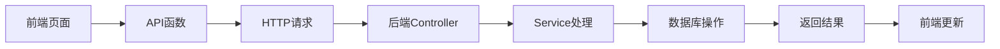

# API 调用详解 - User 模块实战教程

## 🎯 教程概述

本教程将详细讲解如何在芋道框架中调用 API，以 User（用户管理）模块为例，包含：

- 🧠 **API 调用的基本概念**：什么是 API、如何设计 API
- 💻 **前端 API 调用实战**：TypeScript + Axios 完整实现
- 🔧 **后端 API 设计详解**：Controller + Service + API 接口
- 🚀 **实际应用场景**：各种 API 调用的最佳实践

## 📚 目录结构

1. [API 基础概念](#api-基础概念)
2. [前端 API 调用详解](#前端-api-调用详解)
3. [后端 API 设计详解](#后端-api-设计详解)
4. [实战案例分析](#实战案例分析)
5. [最佳实践和技巧](#最佳实践和技巧)

---

## 📖 API 基础概念

### 🤔 什么是 API？

**API (Application Programming Interface)** 就是"应用程序接口"，简单理解就是：

```
前端 ──[HTTP请求]──> 后端API ──[处理]──> 数据库
前端 <──[JSON响应]── 后端API <──[结果]── 数据库
```

**举个生活例子：**
- API 就像餐厅的"菜单"
- 前端就像"顾客"，看菜单点菜
- 后端就像"厨房"，根据订单做菜
- 数据库就像"食材仓库"

### 🏗️ API 的分类

#### 1. **RESTful API**（芋道框架使用的）
```
GET    /api/users      # 查询用户列表
GET    /api/users/123  # 查询单个用户
POST   /api/users      # 创建用户
PUT    /api/users/123  # 修改用户
DELETE /api/users/123  # 删除用户
```

#### 2. **内部 API**（模块间调用）
```java
// 其他模块调用用户模块的 API
@Resource
private AdminUserApi adminUserApi;

AdminUserRespDTO user = adminUserApi.getUser(userId);
```

### 🔄 API 调用流程



---

## 🎨 前端 API 调用详解

### 1. API 接口定义 - 类型安全的基础

#### 🔗 完整的 API 接口文件

```typescript
// src/api/system/user/index.ts - 用户 API 接口定义

import request from '@/config/axios'

/**
 * 用户 VO 接口定义
 * 
 * 作用：定义前后端数据交互的类型
 * 好处：类型安全，IDE 智能提示，编译时错误检查
 */
export interface UserVO {
  id: number              // 用户ID
  username: string        // 用户名
  nickname: string        // 昵称
  deptId: number         // 部门ID
  postIds: string[]      // 岗位ID数组
  email: string          // 邮箱
  mobile: string         // 手机号
  sex: number            // 性别：1=男，2=女
  avatar: string         // 头像URL
  loginIp: string        // 最后登录IP
  status: number         // 状态：0=禁用，1=启用
  remark: string         // 备注
  loginDate: Date        // 最后登录时间
  createTime: Date       // 创建时间
}

/**
 * 分页查询参数接口
 */
export interface UserPageReqVO {
  pageNo: number         // 第几页
  pageSize: number       // 每页多少条
  username?: string      // 用户名搜索
  mobile?: string        // 手机号搜索
  status?: number        // 状态筛选
  deptId?: number        // 部门筛选
  createTime?: string[]  // 创建时间范围
}

// ==================== 基础 CRUD API ====================

/**
 * 查询用户分页列表
 * 
 * @param params 查询参数
 * @returns 分页结果
 */
export const getUserPage = (params: UserPageReqVO) => {
  return request.get({ url: '/system/user/page', params })
}

/**
 * 查询用户详情
 * 
 * @param id 用户ID
 * @returns 用户详情
 */
export const getUser = (id: number) => {
  return request.get({ url: '/system/user/get?id=' + id })
}

/**
 * 新增用户
 * 
 * @param data 用户数据
 * @returns 新用户ID
 */
export const createUser = (data: UserVO) => {
  return request.post({ url: '/system/user/create', data })
}

/**
 * 修改用户
 * 
 * @param data 用户数据
 * @returns 操作结果
 */
export const updateUser = (data: UserVO) => {
  return request.put({ url: '/system/user/update', data })
}

/**
 * 删除用户
 * 
 * @param id 用户ID
 * @returns 操作结果
 */
export const deleteUser = (id: number) => {
  return request.delete({ url: '/system/user/delete?id=' + id })
}

/**
 * 批量删除用户
 * 
 * @param ids 用户ID数组
 * @returns 操作结果
 */
export const deleteUserList = (ids: number[]) => {
  return request.delete({ 
    url: '/system/user/delete-list', 
    params: { ids: ids.join(',') } 
  })
}

// ==================== 特殊功能 API ====================

/**
 * 重置用户密码
 * 
 * @param id 用户ID
 * @param password 新密码
 * @returns 操作结果
 */
export const resetUserPassword = (id: number, password: string) => {
  const data = { id, password }
  return request.put({ url: '/system/user/update-password', data })
}

/**
 * 修改用户状态
 * 
 * @param id 用户ID
 * @param status 状态：0=禁用，1=启用
 * @returns 操作结果
 */
export const updateUserStatus = (id: number, status: number) => {
  const data = { id, status }
  return request.put({ url: '/system/user/update-status', data })
}

/**
 * 获取用户精简信息列表（用于下拉选择）
 * 
 * @returns 用户列表
 */
export const getSimpleUserList = (): Promise<UserVO[]> => {
  return request.get({ url: '/system/user/simple-list' })
}

// ==================== 导入导出 API ====================

/**
 * 导出用户数据
 * 
 * @param params 查询条件
 * @returns Excel文件
 */
export const exportUser = (params: any) => {
  return request.download({ url: '/system/user/export-excel', params })
}

/**
 * 下载用户导入模板
 * 
 * @returns Excel模板文件
 */
export const importUserTemplate = () => {
  return request.download({ url: '/system/user/get-import-template' })
}
```

#### 🔍 API 设计要点详解

**1. 命名规范：**
```typescript
// ✅ 好的命名
getUserPage()        // 获取分页列表
getUser()           // 获取单个
createUser()        // 创建
updateUser()        // 更新
deleteUser()        // 删除

// ❌ 不好的命名
fetchUsers()        // 不明确是分页还是全部
addUser()          // 不如 create 明确
removeUser()       // 不如 delete 明确
```

**2. 参数设计：**
```typescript
// ✅ 使用接口定义参数类型
export const getUserPage = (params: UserPageReqVO) => {
  return request.get({ url: '/system/user/page', params })
}

// ❌ 使用 any 类型
export const getUserPage = (params: any) => {
  return request.get({ url: '/system/user/page', params })
}
```

**3. 返回值类型：**
```typescript
// ✅ 明确返回值类型
export const getSimpleUserList = (): Promise<UserVO[]> => {
  return request.get({ url: '/system/user/simple-list' })
}

// ❌ 没有返回值类型
export const getSimpleUserList = () => {
  return request.get({ url: '/system/user/simple-list' })
}
```

### 2. Vue 组件中的 API 调用实战

#### 🎨 列表页面的 API 调用

```vue
<script lang="ts" setup>
// ==================== 导入 API ====================
import * as UserApi from '@/api/system/user'

// ==================== 响应式数据 ====================
const loading = ref(true)
const total = ref(0)
const list = ref<UserApi.UserVO[]>([])

// 查询参数
const queryParams = reactive<UserApi.UserPageReqVO>({
  pageNo: 1,
  pageSize: 10,
  username: '',
  mobile: '',
  status: undefined,
  deptId: undefined,
  createTime: []
})

// ==================== API 调用方法 ====================

/**
 * 获取用户列表
 * 
 * 关键点：
 * 1. 显示加载状态
 * 2. 异常处理
 * 3. 更新页面数据
 */
const getList = async () => {
  loading.value = true
  try {
    // 调用 API 获取数据
    const data = await UserApi.getUserPage(queryParams)
    
    // 更新页面数据
    list.value = data.list
    total.value = data.total
    
    console.log('获取用户列表成功:', data)
  } catch (error) {
    console.error('获取用户列表失败:', error)
    // 可以显示错误提示
    ElMessage.error('获取用户列表失败')
  } finally {
    loading.value = false
  }
}

/**
 * 搜索用户
 */
const handleQuery = () => {
  queryParams.pageNo = 1  // 重置到第一页
  getList()
}

/**
 * 重置搜索条件
 */
const resetQuery = () => {
  // 重置查询参数
  Object.assign(queryParams, {
    pageNo: 1,
    pageSize: 10,
    username: '',
    mobile: '',
    status: undefined,
    deptId: undefined,
    createTime: []
  })
  getList()
}

// ==================== 单个操作 API 调用 ====================

/**
 * 删除用户
 * 
 * @param id 用户ID
 */
const handleDelete = async (id: number) => {
  try {
    // 确认删除
    await ElMessageBox.confirm('确定要删除这个用户吗？', '提示', {
      confirmButtonText: '确定',
      cancelButtonText: '取消',
      type: 'warning'
    })
    
    // 调用删除 API
    await UserApi.deleteUser(id)
    
    // 显示成功提示
    ElMessage.success('删除成功')
    
    // 刷新列表
    await getList()
    
  } catch (error) {
    if (error !== 'cancel') {  // 用户取消不显示错误
      console.error('删除用户失败:', error)
      ElMessage.error('删除失败')
    }
  }
}

/**
 * 批量删除用户
 */
const checkedIds = ref<number[]>([])

const handleDeleteBatch = async () => {
  if (checkedIds.value.length === 0) {
    ElMessage.warning('请选择要删除的用户')
    return
  }
  
  try {
    await ElMessageBox.confirm(`确定要删除选中的 ${checkedIds.value.length} 个用户吗？`)
    
    // 调用批量删除 API
    await UserApi.deleteUserList(checkedIds.value)
    
    ElMessage.success('批量删除成功')
    
    // 清空选择并刷新列表
    checkedIds.value = []
    await getList()
    
  } catch (error) {
    if (error !== 'cancel') {
      console.error('批量删除失败:', error)
      ElMessage.error('批量删除失败')
    }
  }
}

/**
 * 修改用户状态
 * 
 * @param id 用户ID
 * @param status 新状态
 */
const handleStatusChange = async (id: number, status: number) => {
  const statusText = status === 1 ? '启用' : '禁用'
  
  try {
    await ElMessageBox.confirm(`确定要${statusText}这个用户吗？`)
    
    // 调用状态修改 API
    await UserApi.updateUserStatus(id, status)
    
    ElMessage.success(`${statusText}成功`)
    
    // 刷新列表
    await getList()
    
  } catch (error) {
    if (error !== 'cancel') {
      console.error('修改状态失败:', error)
      ElMessage.error(`${statusText}失败`)
    }
  }
}

// ==================== 导入导出 API 调用 ====================

/**
 * 导出用户数据
 */
const exportLoading = ref(false)

const handleExport = async () => {
  try {
    exportLoading.value = true
    
    // 调用导出 API
    await UserApi.exportUser(queryParams)
    
    ElMessage.success('导出成功')
    
  } catch (error) {
    console.error('导出失败:', error)
    ElMessage.error('导出失败')
  } finally {
    exportLoading.value = false
  }
}

/**
 * 下载导入模板
 */
const handleImportTemplate = async () => {
  try {
    await UserApi.importUserTemplate()
    ElMessage.success('模板下载成功')
  } catch (error) {
    console.error('模板下载失败:', error)
    ElMessage.error('模板下载失败')
  }
}

// ==================== 生命周期 ====================
onMounted(() => {
  getList()  // 页面加载时获取数据
})
</script>
```

#### 🎨 表单组件的 API 调用

```vue
<!-- UserForm.vue - 用户表单组件 -->
<script lang="ts" setup>
import * as UserApi from '@/api/system/user'
import * as DeptApi from '@/api/system/dept'
import * as PostApi from '@/api/system/post'

// ==================== 组件配置 ====================
defineOptions({ name: 'SystemUserForm' })

const { t } = useI18n()
const message = useMessage()

// ==================== 响应式数据 ====================
const dialogVisible = ref(false)
const dialogTitle = ref('')
const formLoading = ref(false)
const formType = ref('')

// 表单数据
const formData = ref<UserApi.UserVO>({
  id: 0,
  username: '',
  nickname: '',
  deptId: 0,
  postIds: [],
  email: '',
  mobile: '',
  sex: 1,
  avatar: '',
  status: 1,
  remark: ''
})

// 下拉选择数据
const deptList = ref<any[]>([])
const postList = ref<any[]>([])

// ==================== 初始化数据 API 调用 ====================

/**
 * 获取部门列表（用于下拉选择）
 */
const getDeptList = async () => {
  try {
    const data = await DeptApi.getSimpleDeptList()
    deptList.value = data
  } catch (error) {
    console.error('获取部门列表失败:', error)
  }
}

/**
 * 获取岗位列表（用于下拉选择）
 */
const getPostList = async () => {
  try {
    const data = await PostApi.getSimplePostList()
    postList.value = data
  } catch (error) {
    console.error('获取岗位列表失败:', error)
  }
}

// ==================== 表单操作 API 调用 ====================

/**
 * 打开表单弹窗
 *
 * @param type 操作类型：'create' | 'update'
 * @param id 用户ID（修改时需要）
 */
const open = async (type: string, id?: number) => {
  dialogVisible.value = true
  dialogTitle.value = type === 'create' ? '新增用户' : '修改用户'
  formType.value = type

  // 重置表单
  resetForm()

  // 加载基础数据
  await Promise.all([
    getDeptList(),
    getPostList()
  ])

  // 修改时加载用户数据
  if (id) {
    formLoading.value = true
    try {
      const userData = await UserApi.getUser(id)
      Object.assign(formData.value, userData)
    } catch (error) {
      console.error('获取用户详情失败:', error)
      ElMessage.error('获取用户详情失败')
    } finally {
      formLoading.value = false
    }
  }
}

// 暴露方法给父组件
defineExpose({ open })

/**
 * 提交表单
 */
const emit = defineEmits(['success'])

const submitForm = async () => {
  // 表单校验
  const formRef = ref()
  if (!formRef.value) return

  const valid = await formRef.value.validate()
  if (!valid) return

  formLoading.value = true
  try {
    if (formType.value === 'create') {
      // 创建用户
      await UserApi.createUser(formData.value)
      message.success('创建成功')
    } else {
      // 修改用户
      await UserApi.updateUser(formData.value)
      message.success('修改成功')
    }

    dialogVisible.value = false
    emit('success')  // 通知父组件刷新列表

  } catch (error) {
    console.error('提交失败:', error)
    message.error('提交失败')
  } finally {
    formLoading.value = false
  }
}

/**
 * 重置表单
 */
const resetForm = () => {
  formData.value = {
    id: 0,
    username: '',
    nickname: '',
    deptId: 0,
    postIds: [],
    email: '',
    mobile: '',
    sex: 1,
    avatar: '',
    status: 1,
    remark: ''
  }
}
</script>
```

#### 🔍 API 调用的关键技巧

**1. 并发请求优化：**
```typescript
// ✅ 并发加载多个接口，提高性能
await Promise.all([
  getDeptList(),
  getPostList(),
  getRoleList()
])

// ❌ 串行加载，性能差
await getDeptList()
await getPostList()
await getRoleList()
```

**2. 错误处理最佳实践：**
```typescript
const handleDelete = async (id: number) => {
  try {
    await ElMessageBox.confirm('确定要删除吗？')
    await UserApi.deleteUser(id)
    ElMessage.success('删除成功')
    await getList()
  } catch (error) {
    // 区分用户取消和真正的错误
    if (error !== 'cancel') {
      console.error('删除失败:', error)
      ElMessage.error('删除失败')
    }
  }
}
```

**3. 加载状态管理：**
```typescript
const loading = ref(false)

const getData = async () => {
  loading.value = true
  try {
    const data = await UserApi.getUserPage(params)
    // 处理数据
  } finally {
    loading.value = false  // 无论成功失败都要隐藏加载状态
  }
}
```

---

## 🔧 后端 API 设计详解

### 1. Controller 层 - HTTP 接口设计

#### 🎮 用户 Controller 完整实现

```java
/**
 * 用户管理 Controller
 *
 * 作用：提供 HTTP API 接口，处理前端请求
 */
@Tag(name = "管理后台 - 用户管理")
@RestController
@RequestMapping("/system/user")
@Validated
public class UserController {

    @Resource
    private AdminUserService userService;

    // ==================== 基础 CRUD 接口 ====================

    /**
     * 获取用户分页列表
     */
    @GetMapping("/page")
    @Operation(summary = "获得用户分页列表")
    @PreAuthorize("@ss.hasPermission('system:user:list')")
    public CommonResult<PageResult<UserRespVO>> getUserPage(@Valid UserPageReqVO pageReqVO) {
        // 1. 调用 Service 查询数据
        PageResult<AdminUserDO> pageResult = userService.getUserPage(pageReqVO);

        // 2. 转换 DO 为 VO
        return success(BeanUtils.toBean(pageResult, UserRespVO.class));
    }

    /**
     * 获取用户详情
     */
    @GetMapping("/get")
    @Operation(summary = "获得用户详情")
    @Parameter(name = "id", description = "编号", required = true, example = "1024")
    @PreAuthorize("@ss.hasPermission('system:user:query')")
    public CommonResult<UserRespVO> getUser(@RequestParam("id") Long id) {
        AdminUserDO user = userService.getUser(id);
        return success(BeanUtils.toBean(user, UserRespVO.class));
    }

    /**
     * 新增用户
     */
    @PostMapping("/create")
    @Operation(summary = "新增用户")
    @PreAuthorize("@ss.hasPermission('system:user:create')")
    public CommonResult<Long> createUser(@Valid @RequestBody UserSaveReqVO createReqVO) {
        Long userId = userService.createUser(createReqVO);
        return success(userId);
    }

    /**
     * 修改用户
     */
    @PutMapping("/update")
    @Operation(summary = "修改用户")
    @PreAuthorize("@ss.hasPermission('system:user:update')")
    public CommonResult<Boolean> updateUser(@Valid @RequestBody UserSaveReqVO updateReqVO) {
        userService.updateUser(updateReqVO);
        return success(true);
    }

    /**
     * 删除用户
     */
    @DeleteMapping("/delete")
    @Operation(summary = "删除用户")
    @Parameter(name = "id", description = "编号", required = true, example = "1024")
    @PreAuthorize("@ss.hasPermission('system:user:delete')")
    public CommonResult<Boolean> deleteUser(@RequestParam("id") Long id) {
        userService.deleteUser(id);
        return success(true);
    }

    /**
     * 批量删除用户
     */
    @DeleteMapping("/delete-list")
    @Operation(summary = "批量删除用户")
    @Parameter(name = "ids", description = "编号列表", required = true)
    @PreAuthorize("@ss.hasPermission('system:user:delete')")
    public CommonResult<Boolean> deleteUserList(@RequestParam("ids") List<Long> ids) {
        userService.deleteUserList(ids);
        return success(true);
    }

    // ==================== 特殊功能接口 ====================

    /**
     * 重置用户密码
     */
    @PutMapping("/update-password")
    @Operation(summary = "重置用户密码")
    @PreAuthorize("@ss.hasPermission('system:user:update-password')")
    public CommonResult<Boolean> updateUserPassword(@Valid @RequestBody UserUpdatePasswordReqVO reqVO) {
        userService.updateUserPassword(reqVO.getId(), reqVO.getPassword());
        return success(true);
    }

    /**
     * 修改用户状态
     */
    @PutMapping("/update-status")
    @Operation(summary = "修改用户状态")
    @PreAuthorize("@ss.hasPermission('system:user:update')")
    public CommonResult<Boolean> updateUserStatus(@Valid @RequestBody UserUpdateStatusReqVO reqVO) {
        userService.updateUserStatus(reqVO.getId(), reqVO.getStatus());
        return success(true);
    }

    /**
     * 获取用户精简信息列表
     */
    @GetMapping("/simple-list")
    @Operation(summary = "获得用户精简信息列表", description = "只包含被开启的用户，主要用于前端的下拉选项")
    public CommonResult<List<UserSimpleRespVO>> getSimpleUserList() {
        List<AdminUserDO> list = userService.getUserListByStatus(CommonStatusEnum.ENABLE.getStatus());
        return success(BeanUtils.toBean(list, UserSimpleRespVO.class));
    }

    // ==================== 导入导出接口 ====================

    /**
     * 导出用户数据
     */
    @GetMapping("/export-excel")
    @Operation(summary = "导出用户")
    @PreAuthorize("@ss.hasPermission('system:user:export')")
    @ApiAccessLog(operateType = EXPORT)
    public void exportUserExcel(@Valid UserPageReqVO pageReqVO,
                                HttpServletResponse response) throws IOException {
        pageReqVO.setPageSize(PageParam.PAGE_SIZE_NONE);
        List<AdminUserDO> list = userService.getUserPage(pageReqVO).getList();

        // 导出 Excel
        ExcelUtils.write(response, "用户数据.xls", "数据", UserRespVO.class,
                BeanUtils.toBean(list, UserRespVO.class));
    }

    /**
     * 获得导入用户模板
     */
    @GetMapping("/get-import-template")
    @Operation(summary = "获得导入用户模板")
    public void importTemplate(HttpServletResponse response) throws IOException {
        // 手动创建导入模板
        List<UserImportRespVO> list = Arrays.asList(
                UserImportRespVO.builder().username("yunai").deptId(1L).email("yunai@iocoder.cn").build(),
                UserImportRespVO.builder().username("yuanma").deptId(2L).email("yuanma@iocoder.cn").build()
        );
        ExcelUtils.write(response, "用户导入模板.xls", "用户列表", UserImportRespVO.class, list);
    }
}
```

#### 🔍 Controller 设计要点

**1. 统一的响应格式：**
```java
// ✅ 统一使用 CommonResult 包装响应
public CommonResult<UserRespVO> getUser(@RequestParam("id") Long id) {
    AdminUserDO user = userService.getUser(id);
    return success(BeanUtils.toBean(user, UserRespVO.class));
}

// 响应格式：
{
    "code": 0,
    "msg": "操作成功",
    "data": { "id": 1, "username": "admin", ... }
}
```

**2. 参数校验：**
```java
// 使用 @Valid 触发参数校验
public CommonResult<Long> createUser(@Valid @RequestBody UserSaveReqVO createReqVO) {
    // 如果校验失败，会自动返回错误信息
}
```

**3. 权限控制：**
```java
// 每个接口都要有权限控制
@PreAuthorize("@ss.hasPermission('system:user:create')")
public CommonResult<Long> createUser(...) {
    // 只有有权限的用户才能访问
}
```

### 2. 内部 API 设计 - 模块间调用

#### 🔗 AdminUserApi 接口设计

```java
/**
 * Admin 用户 API 接口
 *
 * 作用：提供给其他模块调用的用户相关接口
 * 特点：不需要权限校验，内部调用
 */
public interface AdminUserApi {

    /**
     * 通过用户 ID 查询用户
     *
     * @param id 用户ID
     * @return 用户对象信息
     */
    AdminUserRespDTO getUser(Long id);

    /**
     * 通过用户 ID 查询用户们
     *
     * @param ids 用户 ID 们
     * @return 用户对象信息
     */
    List<AdminUserRespDTO> getUserList(Collection<Long> ids);

    /**
     * 获得指定部门的用户数组
     *
     * @param deptIds 部门数组
     * @return 用户数组
     */
    List<AdminUserRespDTO> getUserListByDeptIds(Collection<Long> deptIds);

    /**
     * 获得指定岗位的用户数组
     *
     * @param postIds 岗位数组
     * @return 用户数组
     */
    List<AdminUserRespDTO> getUserListByPostIds(Collection<Long> postIds);

    /**
     * 获得用户 Map
     *
     * @param ids 用户编号数组
     * @return 用户 Map
     */
    default Map<Long, AdminUserRespDTO> getUserMap(Collection<Long> ids) {
        List<AdminUserRespDTO> users = getUserList(ids);
        return CollectionUtils.convertMap(users, AdminUserRespDTO::getId);
    }

    /**
     * 校验用户是否有效
     *
     * @param id 用户编号
     */
    default void validateUser(Long id) {
        validateUserList(Collections.singleton(id));
    }

    /**
     * 校验用户们是否有效
     *
     * @param ids 用户编号数组
     */
    void validateUserList(Collection<Long> ids);
}
```

#### 🔧 AdminUserApi 实现类

```java
/**
 * Admin 用户 API 实现类
 */
@Service
public class AdminUserApiImpl implements AdminUserApi {

    @Resource
    private AdminUserService userService;
    @Resource
    private DeptService deptService;

    @Override
    public AdminUserRespDTO getUser(Long id) {
        AdminUserDO user = userService.getUser(id);
        return BeanUtils.toBean(user, AdminUserRespDTO.class);
    }

    @Override
    public List<AdminUserRespDTO> getUserList(Collection<Long> ids) {
        // 禁用数据权限，因为是内部 API 调用
        return DataPermissionUtils.executeIgnore(() -> {
            List<AdminUserDO> users = userService.getUserList(ids);
            return BeanUtils.toBean(users, AdminUserRespDTO.class);
        });
    }

    @Override
    public List<AdminUserRespDTO> getUserListByDeptIds(Collection<Long> deptIds) {
        List<AdminUserDO> users = userService.getUserListByDeptIds(deptIds);
        return BeanUtils.toBean(users, AdminUserRespDTO.class);
    }

    @Override
    public List<AdminUserRespDTO> getUserListByPostIds(Collection<Long> postIds) {
        List<AdminUserDO> users = userService.getUserListByPostIds(postIds);
        return BeanUtils.toBean(users, AdminUserRespDTO.class);
    }

    @Override
    public void validateUserList(Collection<Long> ids) {
        userService.validateUserList(ids);
    }
}
```

#### 🔍 内部 API 设计要点

**1. 数据权限处理：**
```java
// 内部 API 调用时禁用数据权限
return DataPermissionUtils.executeIgnore(() -> {
    List<AdminUserDO> users = userService.getUserList(ids);
    return BeanUtils.toBean(users, AdminUserRespDTO.class);
});
```

**2. 便捷方法提供：**
```java
// 提供 default 方法，简化调用
default Map<Long, AdminUserRespDTO> getUserMap(Collection<Long> ids) {
    List<AdminUserRespDTO> users = getUserList(ids);
    return CollectionUtils.convertMap(users, AdminUserRespDTO::getId);
}
```

**3. 批量操作支持：**
```java
// 支持批量查询，提高性能
List<AdminUserRespDTO> getUserList(Collection<Long> ids);
```

---

## 🚀 实战案例分析

### 案例1：用户选择器组件

#### 🎯 需求场景
在很多业务场景中，需要选择用户，比如：
- 分配任务时选择负责人
- 设置审批流程时选择审批人
- 发送通知时选择接收人

#### 💻 前端实现

```vue
<!-- UserSelector.vue - 用户选择器组件 -->
<template>
  <el-select
    v-model="selectedValue"
    placeholder="请选择用户"
    filterable
    remote
    :remote-method="searchUsers"
    :loading="loading"
    @change="handleChange"
  >
    <el-option
      v-for="user in userOptions"
      :key="user.id"
      :label="user.nickname"
      :value="user.id"
    >
      <span>{{ user.nickname }}</span>
      <span style="color: #8492a6; font-size: 13px">{{ user.username }}</span>
    </el-option>
  </el-select>
</template>

<script lang="ts" setup>
import * as UserApi from '@/api/system/user'

// ==================== 组件属性 ====================
interface Props {
  modelValue?: number | number[]  // 支持单选和多选
  multiple?: boolean              // 是否多选
  deptId?: number                // 限制部门
}

const props = withDefaults(defineProps<Props>(), {
  multiple: false
})

const emit = defineEmits(['update:modelValue', 'change'])

// ==================== 响应式数据 ====================
const loading = ref(false)
const userOptions = ref<UserApi.UserVO[]>([])
const selectedValue = ref(props.modelValue)

// ==================== API 调用方法 ====================

/**
 * 搜索用户（支持远程搜索）
 *
 * @param query 搜索关键词
 */
const searchUsers = async (query: string) => {
  if (!query) {
    userOptions.value = []
    return
  }

  loading.value = true
  try {
    // 调用搜索 API
    const params = {
      pageNo: 1,
      pageSize: 20,
      username: query,
      status: 1  // 只查询启用的用户
    }

    if (props.deptId) {
      params.deptId = props.deptId  // 限制部门
    }

    const data = await UserApi.getUserPage(params)
    userOptions.value = data.list

  } catch (error) {
    console.error('搜索用户失败:', error)
  } finally {
    loading.value = false
  }
}

/**
 * 初始化加载用户列表
 */
const loadInitialUsers = async () => {
  loading.value = true
  try {
    // 加载常用用户或全部用户
    const data = await UserApi.getSimpleUserList()
    userOptions.value = data.slice(0, 20)  // 只显示前20个
  } catch (error) {
    console.error('加载用户列表失败:', error)
  } finally {
    loading.value = false
  }
}

/**
 * 处理选择变化
 */
const handleChange = (value: any) => {
  emit('update:modelValue', value)
  emit('change', value)
}

// ==================== 生命周期 ====================
onMounted(() => {
  loadInitialUsers()
})

// 监听外部值变化
watch(() => props.modelValue, (newValue) => {
  selectedValue.value = newValue
})
</script>
```

#### 🔧 使用示例

```vue
<!-- 在其他组件中使用用户选择器 -->
<template>
  <el-form>
    <!-- 单选用户 -->
    <el-form-item label="负责人">
      <UserSelector v-model="formData.assigneeId" />
    </el-form-item>

    <!-- 多选用户 -->
    <el-form-item label="抄送人">
      <UserSelector v-model="formData.ccUserIds" multiple />
    </el-form-item>

    <!-- 限制部门的用户选择 -->
    <el-form-item label="部门负责人">
      <UserSelector v-model="formData.deptLeaderId" :dept-id="formData.deptId" />
    </el-form-item>
  </el-form>
</template>

<script lang="ts" setup>
const formData = reactive({
  assigneeId: null,
  ccUserIds: [],
  deptId: 1,
  deptLeaderId: null
})
</script>
```

### 案例2：用户信息展示组件

#### 🎯 需求场景
在很多地方需要显示用户信息，比如：
- 列表中显示创建者
- 详情页显示负责人
- 评论中显示评论者

#### 💻 前端实现

```vue
<!-- UserInfo.vue - 用户信息展示组件 -->
<template>
  <div class="user-info" :class="{ 'user-info--loading': loading }">
    <template v-if="!loading && userInfo">
      <!-- 头像 -->
      <el-avatar
        :size="size"
        :src="userInfo.avatar"
        :alt="userInfo.nickname"
      >
        {{ userInfo.nickname?.charAt(0) }}
      </el-avatar>

      <!-- 用户信息 -->
      <div class="user-details" v-if="showDetails">
        <div class="user-name">{{ userInfo.nickname }}</div>
        <div class="user-dept" v-if="showDept">{{ userInfo.deptName }}</div>
      </div>
    </template>

    <!-- 加载状态 -->
    <el-skeleton v-else :rows="1" animated />
  </div>
</template>

<script lang="ts" setup>
import * as UserApi from '@/api/system/user'

// ==================== 组件属性 ====================
interface Props {
  userId: number           // 用户ID
  size?: number           // 头像大小
  showDetails?: boolean   // 是否显示详细信息
  showDept?: boolean      // 是否显示部门
}

const props = withDefaults(defineProps<Props>(), {
  size: 32,
  showDetails: true,
  showDept: false
})

// ==================== 响应式数据 ====================
const loading = ref(false)
const userInfo = ref<any>(null)

// 用户信息缓存（避免重复请求）
const userCache = new Map<number, any>()

// ==================== API 调用方法 ====================

/**
 * 获取用户信息
 */
const getUserInfo = async () => {
  if (!props.userId) return

  // 先从缓存中查找
  if (userCache.has(props.userId)) {
    userInfo.value = userCache.get(props.userId)
    return
  }

  loading.value = true
  try {
    const data = await UserApi.getUser(props.userId)
    userInfo.value = data

    // 缓存用户信息
    userCache.set(props.userId, data)

  } catch (error) {
    console.error('获取用户信息失败:', error)
  } finally {
    loading.value = false
  }
}

// ==================== 生命周期 ====================
onMounted(() => {
  getUserInfo()
})

// 监听用户ID变化
watch(() => props.userId, () => {
  getUserInfo()
})
</script>

<style scoped>
.user-info {
  display: flex;
  align-items: center;
  gap: 8px;
}

.user-details {
  flex: 1;
}

.user-name {
  font-weight: 500;
  color: #303133;
}

.user-dept {
  font-size: 12px;
  color: #909399;
}

.user-info--loading {
  opacity: 0.6;
}
</style>
```

#### 🔧 使用示例

```vue
<!-- 在列表中使用 -->
<el-table-column label="创建者">
  <template #default="{ row }">
    <UserInfo :user-id="row.creator" :size="24" />
  </template>
</el-table-column>

<!-- 在详情页使用 -->
<el-descriptions-item label="负责人">
  <UserInfo :user-id="detailData.assigneeId" show-dept />
</el-descriptions-item>
```

### 案例3：跨模块 API 调用

#### 🎯 需求场景
在订单模块中需要显示用户信息，但不能直接访问用户表，需要通过用户模块的 API。

#### 🔧 后端实现

```java
/**
 * 订单服务实现类
 */
@Service
public class OrderServiceImpl implements OrderService {

    @Resource
    private OrderMapper orderMapper;

    @Resource
    private AdminUserApi adminUserApi;  // 注入用户 API

    @Override
    public PageResult<OrderRespVO> getOrderPage(OrderPageReqVO pageReqVO) {
        // 1. 查询订单数据
        PageResult<OrderDO> pageResult = orderMapper.selectPage(pageReqVO);

        // 2. 获取用户ID列表
        Set<Long> userIds = pageResult.getList().stream()
                .map(OrderDO::getUserId)
                .collect(Collectors.toSet());

        // 3. 批量查询用户信息
        Map<Long, AdminUserRespDTO> userMap = adminUserApi.getUserMap(userIds);

        // 4. 组装返回数据
        List<OrderRespVO> orderList = pageResult.getList().stream()
                .map(order -> {
                    OrderRespVO vo = BeanUtils.toBean(order, OrderRespVO.class);

                    // 设置用户信息
                    AdminUserRespDTO user = userMap.get(order.getUserId());
                    if (user != null) {
                        vo.setUserNickname(user.getNickname());
                        vo.setUserAvatar(user.getAvatar());
                    }

                    return vo;
                })
                .collect(Collectors.toList());

        return new PageResult<>(orderList, pageResult.getTotal());
    }

    @Override
    public void createOrder(OrderCreateReqVO createReqVO) {
        // 1. 校验用户是否存在
        adminUserApi.validateUser(createReqVO.getUserId());

        // 2. 创建订单
        OrderDO order = BeanUtils.toBean(createReqVO, OrderDO.class);
        orderMapper.insert(order);
    }
}
```

#### 🔍 跨模块调用要点

**1. 批量查询优化：**
```java
// ✅ 批量查询，减少数据库访问
Map<Long, AdminUserRespDTO> userMap = adminUserApi.getUserMap(userIds);

// ❌ 循环查询，性能差
for (OrderDO order : orders) {
    AdminUserRespDTO user = adminUserApi.getUser(order.getUserId());
}
```

**2. 数据校验：**
```java
// 在创建订单前校验用户是否存在
adminUserApi.validateUser(createReqVO.getUserId());
```

**3. 异常处理：**
```java
try {
    Map<Long, AdminUserRespDTO> userMap = adminUserApi.getUserMap(userIds);
} catch (Exception e) {
    log.error("获取用户信息失败", e);
    // 可以设置默认值或者抛出业务异常
}
```

---

## 💡 最佳实践和技巧

### 1. 前端 API 调用最佳实践

#### 🎯 错误处理策略

```typescript
/**
 * 统一的 API 错误处理
 */
const handleApiError = (error: any, operation: string) => {
  console.error(`${operation}失败:`, error)

  // 根据错误类型显示不同提示
  if (error.code === 401) {
    ElMessage.error('登录已过期，请重新登录')
    // 跳转到登录页
  } else if (error.code === 403) {
    ElMessage.error('没有权限执行此操作')
  } else if (error.code >= 500) {
    ElMessage.error('服务器错误，请稍后重试')
  } else {
    ElMessage.error(error.msg || `${operation}失败`)
  }
}

// 使用示例
const deleteUser = async (id: number) => {
  try {
    await UserApi.deleteUser(id)
    ElMessage.success('删除成功')
  } catch (error) {
    handleApiError(error, '删除用户')
  }
}
```

#### 🚀 性能优化技巧

```typescript
/**
 * 防抖搜索
 */
import { debounce } from 'lodash-es'

const searchUsers = debounce(async (query: string) => {
  if (!query) return

  try {
    const data = await UserApi.getUserPage({
      pageNo: 1,
      pageSize: 10,
      username: query
    })
    userList.value = data.list
  } catch (error) {
    console.error('搜索失败:', error)
  }
}, 300)  // 300ms 防抖

/**
 * 请求缓存
 */
const userCache = new Map<number, UserApi.UserVO>()

const getUserWithCache = async (id: number) => {
  // 先从缓存获取
  if (userCache.has(id)) {
    return userCache.get(id)
  }

  // 缓存中没有，请求 API
  const user = await UserApi.getUser(id)
  userCache.set(id, user)
  return user
}

/**
 * 并发请求控制
 */
const requestQueue = new Map<string, Promise<any>>()

const getUserSafe = (id: number) => {
  const key = `user_${id}`

  // 如果已有相同请求在进行中，直接返回
  if (requestQueue.has(key)) {
    return requestQueue.get(key)
  }

  // 创建新请求
  const promise = UserApi.getUser(id).finally(() => {
    requestQueue.delete(key)  // 请求完成后清除
  })

  requestQueue.set(key, promise)
  return promise
}
```

#### 🔄 状态管理

```typescript
/**
 * 使用 Pinia 管理用户状态
 */
// stores/user.ts
export const useUserStore = defineStore('user', () => {
  const userList = ref<UserApi.UserVO[]>([])
  const loading = ref(false)
  const currentUser = ref<UserApi.UserVO | null>(null)

  // 获取用户列表
  const fetchUserList = async (params: UserApi.UserPageReqVO) => {
    loading.value = true
    try {
      const data = await UserApi.getUserPage(params)
      userList.value = data.list
      return data
    } finally {
      loading.value = false
    }
  }

  // 获取当前用户信息
  const fetchCurrentUser = async () => {
    try {
      const user = await UserApi.getCurrentUser()
      currentUser.value = user
      return user
    } catch (error) {
      console.error('获取当前用户失败:', error)
    }
  }

  return {
    userList,
    loading,
    currentUser,
    fetchUserList,
    fetchCurrentUser
  }
})

// 在组件中使用
const userStore = useUserStore()

onMounted(() => {
  userStore.fetchUserList(queryParams)
})
```

### 2. 后端 API 设计最佳实践

#### 🎯 统一响应格式

```java
/**
 * 统一响应结果
 */
@Data
public class CommonResult<T> {
    private Integer code;    // 错误码：0=成功，其他=失败
    private String msg;      // 错误信息
    private T data;          // 返回数据

    public static <T> CommonResult<T> success(T data) {
        CommonResult<T> result = new CommonResult<>();
        result.setCode(0);
        result.setMsg("操作成功");
        result.setData(data);
        return result;
    }

    public static <T> CommonResult<T> error(Integer code, String msg) {
        CommonResult<T> result = new CommonResult<>();
        result.setCode(code);
        result.setMsg(msg);
        return result;
    }
}
```

#### 🔧 参数校验

```java
/**
 * 用户保存请求 VO
 */
@Data
public class UserSaveReqVO {

    @Schema(description = "用户编号", example = "1024")
    private Long id;

    @Schema(description = "用户账号", requiredMode = Schema.RequiredMode.REQUIRED, example = "yudao")
    @NotBlank(message = "用户账号不能为空")
    @Pattern(regexp = "^[a-zA-Z0-9]{4,30}$", message = "用户账号由 数字、字母 组成")
    @Size(min = 4, max = 30, message = "用户账号长度为 4-30 个字符")
    private String username;

    @Schema(description = "用户昵称", requiredMode = Schema.RequiredMode.REQUIRED, example = "芋道")
    @Size(max = 30, message = "用户昵称长度不能超过30个字符")
    private String nickname;

    @Schema(description = "用户邮箱", example = "yudao@iocoder.cn")
    @Email(message = "邮箱格式不正确")
    @Size(max = 50, message = "邮箱长度不能超过 50 个字符")
    private String email;

    @Schema(description = "手机号码", example = "15601691300")
    @Mobile
    private String mobile;
}
```

#### 🚀 性能优化

```java
/**
 * 批量查询优化
 */
@Service
public class UserServiceImpl implements UserService {

    @Override
    public List<UserRespVO> getUserListWithDept(Collection<Long> userIds) {
        if (CollUtil.isEmpty(userIds)) {
            return Collections.emptyList();
        }

        // 1. 批量查询用户
        List<AdminUserDO> users = userMapper.selectBatchIds(userIds);

        // 2. 批量查询部门
        Set<Long> deptIds = users.stream()
                .map(AdminUserDO::getDeptId)
                .filter(Objects::nonNull)
                .collect(Collectors.toSet());

        Map<Long, DeptDO> deptMap = deptService.getDeptMap(deptIds);

        // 3. 组装数据
        return users.stream()
                .map(user -> {
                    UserRespVO vo = BeanUtils.toBean(user, UserRespVO.class);
                    DeptDO dept = deptMap.get(user.getDeptId());
                    if (dept != null) {
                        vo.setDeptName(dept.getName());
                    }
                    return vo;
                })
                .collect(Collectors.toList());
    }
}
```

### 3. API 调用安全实践

#### 🛡️ 权限控制

```java
/**
 * 数据权限控制
 */
@PreAuthorize("@ss.hasPermission('system:user:query')")
public CommonResult<PageResult<UserRespVO>> getUserPage(UserPageReqVO pageReqVO) {
    // 自动应用数据权限，用户只能看到自己权限范围内的数据
    PageResult<AdminUserDO> pageResult = userService.getUserPage(pageReqVO);
    return success(BeanUtils.toBean(pageResult, UserRespVO.class));
}
```

#### 🔐 敏感信息处理

```java
/**
 * 用户响应 VO - 不包含敏感信息
 */
@Data
public class UserRespVO {
    private Long id;
    private String username;
    private String nickname;
    private String email;
    private String mobile;
    // 不包含密码、盐值等敏感信息
}

/**
 * 用户详情 VO - 包含更多信息
 */
@Data
public class UserDetailRespVO extends UserRespVO {
    private String loginIp;
    private LocalDateTime loginDate;
    private LocalDateTime createTime;
    // 仍然不包含密码等敏感信息
}
```

## 🎉 总结

通过这个详细的 API 调用教程，你学到了：

### 🎓 **核心技能**
- **API 设计原则**：RESTful 设计、统一响应格式、参数校验
- **前端调用技巧**：TypeScript 类型安全、错误处理、性能优化
- **后端接口开发**：Controller 设计、内部 API、权限控制
- **实战应用**：用户选择器、信息展示、跨模块调用

### 🚀 **最佳实践**
- **类型安全**：使用 TypeScript 接口定义
- **错误处理**：统一的错误处理策略
- **性能优化**：防抖、缓存、批量查询
- **安全控制**：权限校验、敏感信息保护

### 💡 **实用技巧**
- **组件化**：封装可复用的 API 调用组件
- **状态管理**：使用 Pinia 管理 API 状态
- **并发控制**：避免重复请求
- **缓存策略**：合理使用缓存提高性能

现在你已经掌握了完整的 API 调用技能，可以在实际项目中灵活运用这些知识！🎯
