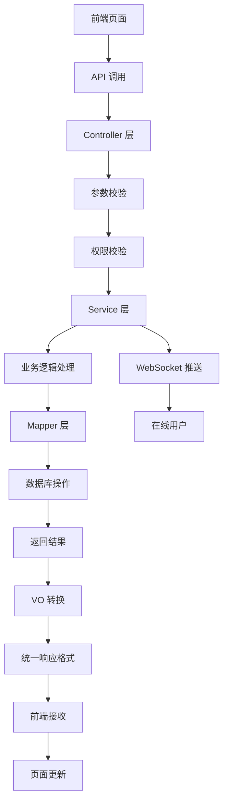

# Notice 模块完整实战 - 前后端全栈开发

## 🎯 项目概述

本文档将带你完整地开发一个通知公告模块，包含：
- **后端**：Spring Boot + MyBatis-Plus + MySQL
- **前端**：Vue 3 + TypeScript + Element Plus
- **功能**：增删改查 + 分页 + 搜索 + 批量操作 + 实时推送

## 📁 项目结构总览

```
Notice 模块/
├── 后端 (Java)
│   ├── controller/          # 控制器层
│   │   ├── NoticeController.java
│   │   └── vo/             # 数据传输对象
│   │       ├── NoticePageReqVO.java
│   │       ├── NoticeRespVO.java
│   │       └── NoticeSaveReqVO.java
│   ├── service/            # 服务层
│   │   ├── NoticeService.java
│   │   └── NoticeServiceImpl.java
│   ├── dal/                # 数据访问层
│   │   ├── dataobject/
│   │   │   └── NoticeDO.java
│   │   └── mysql/
│   │       └── NoticeMapper.java
│   └── enums/
│       └── NoticeTypeEnum.java
└── 前端 (Vue 3 + TypeScript)
    ├── api/                # API 接口
    │   └── system/notice/index.ts
    └── views/              # 页面组件
        └── system/notice/
            ├── index.vue   # 列表页面
            └── NoticeForm.vue  # 表单弹窗
```

## 🗄️ 数据库设计

### 建表 SQL

```sql
-- `ruoyi-vue-pro`.system_notice definition

CREATE TABLE `system_notice` (
  `id` bigint NOT NULL AUTO_INCREMENT COMMENT '公告ID',
  `title` varchar(50) CHARACTER SET utf8mb4 COLLATE utf8mb4_unicode_ci NOT NULL COMMENT '公告标题',
  `content` text CHARACTER SET utf8mb4 COLLATE utf8mb4_unicode_ci NOT NULL COMMENT '公告内容',
  `type` tinyint NOT NULL COMMENT '公告类型（1通知 2公告）',
  `status` tinyint NOT NULL DEFAULT '0' COMMENT '公告状态（0正常 1关闭）',
  `creator` varchar(64) CHARACTER SET utf8mb4 COLLATE utf8mb4_unicode_ci DEFAULT '' COMMENT '创建者',
  `create_time` datetime NOT NULL DEFAULT CURRENT_TIMESTAMP COMMENT '创建时间',
  `updater` varchar(64) CHARACTER SET utf8mb4 COLLATE utf8mb4_unicode_ci DEFAULT '' COMMENT '更新者',
  `update_time` datetime NOT NULL DEFAULT CURRENT_TIMESTAMP ON UPDATE CURRENT_TIMESTAMP COMMENT '更新时间',
  `deleted` bit(1) NOT NULL DEFAULT b'0' COMMENT '是否删除',
  `tenant_id` bigint NOT NULL DEFAULT '0' COMMENT '租户编号',
  PRIMARY KEY (`id`) USING BTREE
) ENGINE=InnoDB AUTO_INCREMENT=5 DEFAULT CHARSET=utf8mb4 COLLATE=utf8mb4_unicode_ci COMMENT='通知公告表';
```

### 示例数据

```sql
INSERT INTO `system_notice` VALUES 
(1, '系统维护通知', '系统将于今晚22:00-24:00进行维护，请提前保存工作。', 1, 0, 'admin', '2024-01-15 10:30:00', 'admin', '2024-01-15 10:30:00', 0, 1),
(2, '新功能发布公告', '我们很高兴地宣布新功能已经上线！', 2, 0, 'admin', '2024-01-16 09:00:00', 'admin', '2024-01-16 09:00:00', 0, 1);
```

## 🔧 后端开发

### 1. 数据对象 (DO)

```java
// NoticeDO.java - 数据库实体类
@TableName("system_notice")
@KeySequence("system_notice_seq")
@Data
@EqualsAndHashCode(callSuper = true)
public class NoticeDO extends BaseDO {

    /**
     * 公告ID
     */
    private Long id;
    
    /**
     * 公告标题
     */
    private String title;
    
    /**
     * 公告类型
     * 枚举 {@link NoticeTypeEnum}
     */
    private Integer type;
    
    /**
     * 公告内容
     */
    private String content;
    
    /**
     * 公告状态
     * 枚举 {@link CommonStatusEnum}
     */
    private Integer status;
    
    // 从 BaseDO 继承：createTime, updateTime, creator, updater, deleted, tenantId
}
```

### 2. 枚举类

```java
// NoticeTypeEnum.java - 通知类型枚举
@Getter
@AllArgsConstructor
public enum NoticeTypeEnum {

    NOTICE(1),        // 通知
    ANNOUNCEMENT(2);  // 公告

    /**
     * 类型值
     */
    private final Integer type;
}
```

### 3. VO 对象

#### 请求 VO

```java
// NoticeSaveReqVO.java - 创建/修改请求 VO
@Schema(description = "管理后台 - 通知公告创建/修改 Request VO")
@Data
public class NoticeSaveReqVO {

    @Schema(description = "岗位公告编号", example = "1024")
    private Long id;

    @Schema(description = "公告标题", requiredMode = Schema.RequiredMode.REQUIRED, example = "小博主")
    @NotBlank(message = "公告标题不能为空")
    @Size(max = 50, message = "公告标题不能超过50个字符")
    private String title;

    @Schema(description = "公告类型", requiredMode = Schema.RequiredMode.REQUIRED, example = "1")
    @NotNull(message = "公告类型不能为空")
    private Integer type;

    @Schema(description = "公告内容", requiredMode = Schema.RequiredMode.REQUIRED, example = "半生编码")
    private String content;

    @Schema(description = "状态，参见 CommonStatusEnum 枚举类", requiredMode = Schema.RequiredMode.REQUIRED, example = "1")
    private Integer status;
}
```

```java
// NoticePageReqVO.java - 分页查询请求 VO
@Schema(description = "管理后台 - 通知公告分页 Request VO")
@Data
@EqualsAndHashCode(callSuper = true)
public class NoticePageReqVO extends PageParam {

    @Schema(description = "通知公告名称，模糊匹配", example = "芋道")
    private String title;

    @Schema(description = "展示状态，参见 CommonStatusEnum 枚举类", example = "1")
    private Integer status;
}
```

#### 响应 VO

```java
// NoticeRespVO.java - 响应 VO
@Schema(description = "管理后台 - 通知公告信息 Response VO")
@Data
public class NoticeRespVO {

    @Schema(description = "通知公告序号", requiredMode = Schema.RequiredMode.REQUIRED, example = "1024")
    private Long id;

    @Schema(description = "公告标题", requiredMode = Schema.RequiredMode.REQUIRED, example = "小博主")
    private String title;

    @Schema(description = "公告类型", requiredMode = Schema.RequiredMode.REQUIRED, example = "1")
    private Integer type;

    @Schema(description = "公告内容", requiredMode = Schema.RequiredMode.REQUIRED, example = "半生编码")
    private String content;

    @Schema(description = "状态，参见 CommonStatusEnum 枚举类", requiredMode = Schema.RequiredMode.REQUIRED, example = "1")
    private Integer status;

    @Schema(description = "创建时间", requiredMode = Schema.RequiredMode.REQUIRED, example = "时间戳格式")
    private LocalDateTime createTime;
}
```

### 4. 数据访问层 (Mapper)

```java
// NoticeMapper.java - 数据访问接口
@Mapper
public interface NoticeMapper extends BaseMapperX<NoticeDO> {

    default PageResult<NoticeDO> selectPage(NoticePageReqVO reqVO) {
        return selectPage(reqVO, new LambdaQueryWrapperX<NoticeDO>()
                .likeIfPresent(NoticeDO::getTitle, reqVO.getTitle())      // 标题模糊查询
                .eqIfPresent(NoticeDO::getStatus, reqVO.getStatus())      // 状态精确查询
                .orderByDesc(NoticeDO::getId));                           // 按ID降序排列
    }
}
```

### 5. 服务层 (Service)

#### 接口定义

```java
// NoticeService.java - 服务接口
public interface NoticeService {

    /**
     * 创建通知公告
     */
    Long createNotice(NoticeSaveReqVO createReqVO);

    /**
     * 更新通知公告
     */
    void updateNotice(NoticeSaveReqVO reqVO);

    /**
     * 删除通知公告
     */
    void deleteNotice(Long id);

    /**
     * 批量删除通知公告
     */
    void deleteNoticeList(List<Long> ids);

    /**
     * 获得通知公告分页列表
     */
    PageResult<NoticeDO> getNoticePage(NoticePageReqVO reqVO);

    /**
     * 获得通知公告
     */
    NoticeDO getNotice(Long id);
}
```

#### 实现类

```java
// NoticeServiceImpl.java - 服务实现类
@Service
public class NoticeServiceImpl implements NoticeService {

    @Resource
    private NoticeMapper noticeMapper;

    @Override
    public Long createNotice(NoticeSaveReqVO createReqVO) {
        // 1. 将 VO 转换成 DO
        NoticeDO notice = BeanUtils.toBean(createReqVO, NoticeDO.class);
        
        // 2. 插入数据库
        noticeMapper.insert(notice);
        
        // 3. 返回自动生成的 ID
        return notice.getId();
    }

    @Override
    public void updateNotice(NoticeSaveReqVO updateReqVO) {
        // 1. 校验通知是否存在
        validateNoticeExists(updateReqVO.getId());
        
        // 2. 将 VO 转换成 DO
        NoticeDO updateObj = BeanUtils.toBean(updateReqVO, NoticeDO.class);
        
        // 3. 更新数据库
        noticeMapper.updateById(updateObj);
    }

    @Override
    public void deleteNotice(Long id) {
        // 1. 校验通知是否存在
        validateNoticeExists(id);
        
        // 2. 删除（逻辑删除，不是真删除）
        noticeMapper.deleteById(id);
    }

    @Override
    public void deleteNoticeList(List<Long> ids) {
        // 批量删除，不校验是否存在（提高性能）
        noticeMapper.deleteByIds(ids);
    }

    @Override
    public PageResult<NoticeDO> getNoticePage(NoticePageReqVO reqVO) {
        // 直接调用 Mapper 的分页查询方法
        return noticeMapper.selectPage(reqVO);
    }

    @Override
    public NoticeDO getNotice(Long id) {
        // 根据 ID 查询单个记录
        return noticeMapper.selectById(id);
    }

    /**
     * 校验通知是否存在
     */
    @VisibleForTesting
    public void validateNoticeExists(Long id) {
        if (id == null) {
            return;
        }
        NoticeDO notice = noticeMapper.selectById(id);
        if (notice == null) {
            throw exception(NOTICE_NOT_FOUND);
        }
    }
}
```

### 6. 控制器层 (Controller)

```java
// NoticeController.java - REST 控制器
@Tag(name = "管理后台 - 通知公告")
@RestController
@RequestMapping("/system/notice")
@Validated
public class NoticeController {

    @Resource
    private NoticeService noticeService;

    @Resource
    private WebSocketSenderApi webSocketSenderApi;

    @PostMapping("/create")
    @Operation(summary = "创建通知公告")
    @PreAuthorize("@ss.hasPermission('system:notice:create')")
    public CommonResult<Long> createNotice(@Valid @RequestBody NoticeSaveReqVO createReqVO) {
        Long noticeId = noticeService.createNotice(createReqVO);
        return success(noticeId);
    }

    @PutMapping("/update")
    @Operation(summary = "修改通知公告")
    @PreAuthorize("@ss.hasPermission('system:notice:update')")
    public CommonResult<Boolean> updateNotice(@Valid @RequestBody NoticeSaveReqVO updateReqVO) {
        noticeService.updateNotice(updateReqVO);
        return success(true);
    }

    @DeleteMapping("/delete")
    @Operation(summary = "删除通知公告")
    @Parameter(name = "id", description = "编号", required = true, example = "1024")
    @PreAuthorize("@ss.hasPermission('system:notice:delete')")
    public CommonResult<Boolean> deleteNotice(@RequestParam("id") Long id) {
        noticeService.deleteNotice(id);
        return success(true);
    }

    @DeleteMapping("/delete-list")
    @Operation(summary = "批量删除通知公告")
    @Parameter(name = "ids", description = "编号列表", required = true)
    @PreAuthorize("@ss.hasPermission('system:notice:delete')")
    public CommonResult<Boolean> deleteNoticeList(@RequestParam("ids") List<Long> ids) {
        noticeService.deleteNoticeList(ids);
        return success(true);
    }

    @GetMapping("/page")
    @Operation(summary = "获取通知公告列表")
    @PreAuthorize("@ss.hasPermission('system:notice:query')")
    public CommonResult<PageResult<NoticeRespVO>> getNoticePage(@Validated NoticePageReqVO pageReqVO) {
        PageResult<NoticeDO> pageResult = noticeService.getNoticePage(pageReqVO);
        return success(BeanUtils.toBean(pageResult, NoticeRespVO.class));
    }

    @GetMapping("/get")
    @Operation(summary = "获得通知公告")
    @Parameter(name = "id", description = "编号", required = true, example = "1024")
    @PreAuthorize("@ss.hasPermission('system:notice:query')")
    public CommonResult<NoticeRespVO> getNotice(@RequestParam("id") Long id) {
        NoticeDO notice = noticeService.getNotice(id);
        return success(BeanUtils.toBean(notice, NoticeRespVO.class));
    }

    @PostMapping("/push")
    @Operation(summary = "推送通知公告", description = "只发送给 websocket 连接在线的用户")
    @Parameter(name = "id", description = "编号", required = true, example = "1024")
    @PreAuthorize("@ss.hasPermission('system:notice:update')")
    public CommonResult<Boolean> push(@RequestParam("id") Long id) {
        NoticeDO notice = noticeService.getNotice(id);
        Assert.notNull(notice, "公告不能为空");
        // 通过 websocket 推送给在线的用户
        webSocketSenderApi.sendObject(UserTypeEnum.ADMIN.getValue(), "notice-push", notice);
        return success(true);
    }
}
```

## 🎨 前端开发

### 1. API 接口层

```typescript
// api/system/notice/index.ts - API 接口定义
import request from '@/config/axios'

// 通知 VO 接口定义
export interface NoticeVO {
  id: number | undefined
  title: string
  type: number
  content: string
  status: number
  remark: string
  creator: string
  createTime: Date
}

// 查询公告列表
export const getNoticePage = (params: PageParam) => {
  return request.get({ url: '/system/notice/page', params })
}

// 查询公告详情
export const getNotice = (id: number) => {
  return request.get({ url: '/system/notice/get?id=' + id })
}

// 新增公告
export const createNotice = (data: NoticeVO) => {
  return request.post({ url: '/system/notice/create', data })
}

// 修改公告
export const updateNotice = (data: NoticeVO) => {
  return request.put({ url: '/system/notice/update', data })
}

// 删除公告
export const deleteNotice = (id: number) => {
  return request.delete({ url: '/system/notice/delete?id=' + id })
}

// 批量删除公告
export const deleteNoticeList = (ids: number[]) => {
  return request.delete({ url: '/system/notice/delete-list', params: { ids: ids.join(',') } })
}

// 推送公告
export const pushNotice = (id: number) => {
  return request.post({ url: '/system/notice/push?id=' + id })
}
```

### 2. 列表页面组件

```vue
<!-- views/system/notice/index.vue - 通知公告列表页面 -->
<template>
  <ContentWrap>
    <!-- 搜索工作栏 -->
    <el-form
      class="-mb-15px"
      :model="queryParams"
      ref="queryFormRef"
      :inline="true"
      label-width="68px"
    >
      <el-form-item label="公告标题" prop="title">
        <el-input
          v-model="queryParams.title"
          placeholder="请输入公告标题"
          clearable
          @keyup.enter="handleQuery"
          class="!w-240px"
        />
      </el-form-item>
      <el-form-item label="公告状态" prop="status">
        <el-select
          v-model="queryParams.status"
          placeholder="请选择公告状态"
          clearable
          class="!w-240px"
        >
          <el-option
            v-for="dict in getIntDictOptions(DICT_TYPE.COMMON_STATUS)"
            :key="dict.value"
            :label="dict.label"
            :value="dict.value"
          />
        </el-select>
      </el-form-item>
      <el-form-item>
        <el-button @click="handleQuery">
          <Icon icon="ep:search" class="mr-5px" /> 搜索
        </el-button>
        <el-button @click="resetQuery">
          <Icon icon="ep:refresh" class="mr-5px" /> 重置
        </el-button>
        <el-button
          type="primary"
          plain
          @click="openForm('create')"
          v-hasPermi="['system:notice:create']"
        >
          <Icon icon="ep:plus" class="mr-5px" /> 新增
        </el-button>
        <el-button
          type="danger"
          plain
          :disabled="checkedIds.length === 0"
          @click="handleDeleteBatch"
          v-hasPermi="['system:notice:delete']"
        >
          <Icon icon="ep:delete" class="mr-5px" /> 批量删除
        </el-button>
      </el-form-item>
    </el-form>
  </ContentWrap>

  <!-- 列表 -->
  <ContentWrap>
    <el-table v-loading="loading" :data="list" @selection-change="handleRowCheckboxChange">
      <el-table-column type="selection" width="55" />
      <el-table-column label="公告编号" align="center" prop="id" />
      <el-table-column label="公告标题" align="center" prop="title" />
      <el-table-column label="公告类型" align="center" prop="type">
        <template #default="scope">
          <dict-tag :type="DICT_TYPE.SYSTEM_NOTICE_TYPE" :value="scope.row.type" />
        </template>
      </el-table-column>
      <el-table-column label="状态" align="center" prop="status">
        <template #default="scope">
          <dict-tag :type="DICT_TYPE.COMMON_STATUS" :value="scope.row.status" />
        </template>
      </el-table-column>
      <el-table-column
        label="创建时间"
        align="center"
        prop="createTime"
        width="180"
        :formatter="dateFormatter"
      />
      <el-table-column label="操作" align="center">
        <template #default="scope">
          <el-button
            link
            type="primary"
            @click="openForm('update', scope.row.id)"
            v-hasPermi="['system:notice:update']"
          >
            编辑
          </el-button>
          <el-button
            link
            type="danger"
            @click="handleDelete(scope.row.id)"
            v-hasPermi="['system:notice:delete']"
          >
            删除
          </el-button>
          <el-button
            link
            @click="handlePush(scope.row.id)"
            v-hasPermi="['system:notice:update']"
          >
            推送
          </el-button>
        </template>
      </el-table-column>
    </el-table>

    <!-- 分页 -->
    <Pagination
      :total="total"
      v-model:page="queryParams.pageNo"
      v-model:limit="queryParams.pageSize"
      @pagination="getList"
    />
  </ContentWrap>

  <!-- 表单弹窗：添加/修改 -->
  <NoticeForm ref="formRef" @success="getList" />
</template>

<script lang="ts" setup>
import { DICT_TYPE, getIntDictOptions } from '@/utils/dict'
import { dateFormatter } from '@/utils/formatTime'
import * as NoticeApi from '@/api/system/notice'
import NoticeForm from './NoticeForm.vue'

defineOptions({ name: 'SystemNotice' })

const message = useMessage() // 消息弹窗
const { t } = useI18n() // 国际化

const loading = ref(true) // 列表的加载中
const total = ref(0) // 列表的总页数
const list = ref([]) // 列表的数据
const queryParams = reactive({
  pageNo: 1,
  pageSize: 10,
  title: '',
  type: undefined,
  status: undefined
})
const queryFormRef = ref() // 搜索的表单

/** 查询公告列表 */
const getList = async () => {
  loading.value = true
  try {
    const data = await NoticeApi.getNoticePage(queryParams)
    list.value = data.list
    total.value = data.total
  } finally {
    loading.value = false
  }
}

/** 搜索按钮操作 */
const handleQuery = () => {
  queryParams.pageNo = 1
  getList()
}

/** 重置按钮操作 */
const resetQuery = () => {
  queryFormRef.value.resetFields()
  handleQuery()
}

/** 添加/修改操作 */
const formRef = ref()
const openForm = (type: string, id?: number) => {
  formRef.value.open(type, id)
}

/** 删除按钮操作 */
const handleDelete = async (id: number) => {
  try {
    // 删除的二次确认
    await message.delConfirm()
    // 发起删除
    await NoticeApi.deleteNotice(id)
    message.success(t('common.delSuccess'))
    // 刷新列表
    await getList()
  } catch {}
}

/** 批量删除按钮操作 */
const checkedIds = ref<number[]>([])
const handleRowCheckboxChange = (rows: NoticeApi.NoticeVO[]) => {
  checkedIds.value = rows.map((row) => row.id)
}

const handleDeleteBatch = async () => {
  try {
    // 删除的二次确认
    await message.delConfirm()
    // 发起批量删除
    await NoticeApi.deleteNoticeList(checkedIds.value)
    message.success(t('common.delSuccess'))
    // 刷新列表
    await getList()
  } catch {}
}

/** 推送按钮操作 */
const handlePush = async (id: number) => {
  try {
    // 推送的二次确认
    await message.confirm('是否推送所选中通知？')
    // 发起推送
    await NoticeApi.pushNotice(id)
    message.success('推送成功')
  } catch {}
}

/** 初始化 **/
onMounted(() => {
  getList()
})
</script>
```

### 3. 表单弹窗组件

```vue
<!-- views/system/notice/NoticeForm.vue - 通知公告表单弹窗 -->
<template>
  <Dialog v-model="dialogVisible" :title="dialogTitle" width="800">
    <el-form
      ref="formRef"
      v-loading="formLoading"
      :model="formData"
      :rules="formRules"
      label-width="80px"
    >
      <el-form-item label="公告标题" prop="title">
        <el-input v-model="formData.title" placeholder="请输入公告标题" />
      </el-form-item>
      <el-form-item label="公告内容" prop="content">
        <Editor v-model="formData.content" height="150px" />
      </el-form-item>
      <el-form-item label="公告类型" prop="type">
        <el-select v-model="formData.type" clearable placeholder="请选择公告类型">
          <el-option
            v-for="dict in getIntDictOptions(DICT_TYPE.SYSTEM_NOTICE_TYPE)"
            :key="parseInt(dict.value as any)"
            :label="dict.label"
            :value="parseInt(dict.value as any)"
          />
        </el-select>
      </el-form-item>
      <el-form-item label="状态" prop="status">
        <el-select v-model="formData.status" clearable placeholder="请选择状态">
          <el-option
            v-for="dict in getIntDictOptions(DICT_TYPE.COMMON_STATUS)"
            :key="parseInt(dict.value as any)"
            :label="dict.label"
            :value="parseInt(dict.value as any)"
          />
        </el-select>
      </el-form-item>
      <el-form-item label="备注" prop="remark">
        <el-input v-model="formData.remark" placeholder="请输备注" type="textarea" />
      </el-form-item>
    </el-form>
    <template #footer>
      <el-button :disabled="formLoading" type="primary" @click="submitForm">确 定</el-button>
      <el-button @click="dialogVisible = false">取 消</el-button>
    </template>
  </Dialog>
</template>

<script lang="ts" setup>
import { DICT_TYPE, getIntDictOptions } from '@/utils/dict'
import { CommonStatusEnum } from '@/utils/constants'
import * as NoticeApi from '@/api/system/notice'

defineOptions({ name: 'SystemNoticeForm' })

const { t } = useI18n() // 国际化
const message = useMessage() // 消息弹窗

const dialogVisible = ref(false) // 弹窗的是否展示
const dialogTitle = ref('') // 弹窗的标题
const formLoading = ref(false) // 表单的加载中：1）修改时的数据加载；2）提交的按钮禁用
const formType = ref('') // 表单的类型：create - 新增；update - 修改
const formData = ref({
  id: undefined,
  title: '',
  type: undefined,
  content: '',
  status: CommonStatusEnum.ENABLE,
  remark: ''
})
const formRules = reactive({
  title: [{ required: true, message: '公告标题不能为空', trigger: 'blur' }],
  type: [{ required: true, message: '公告类型不能为空', trigger: 'change' }],
  status: [{ required: true, message: '状态不能为空', trigger: 'change' }],
  content: [{ required: true, message: '公告内容不能为空', trigger: 'blur' }]
})
const formRef = ref() // 表单 Ref

/** 打开弹窗 */
const open = async (type: string, id?: number) => {
  dialogVisible.value = true
  dialogTitle.value = t('action.' + type)
  formType.value = type
  resetForm()
  // 修改时，设置数据
  if (id) {
    formLoading.value = true
    try {
      formData.value = await NoticeApi.getNotice(id)
    } finally {
      formLoading.value = false
    }
  }
}
defineExpose({ open }) // 提供 open 方法，用于打开弹窗

/** 提交表单 */
const emit = defineEmits(['success']) // 定义 success 事件，用于操作成功后的回调
const submitForm = async () => {
  // 校验表单
  if (!formRef) return
  const valid = await formRef.value.validate()
  if (!valid) return
  // 提交请求
  formLoading.value = true
  try {
    const data = formData.value as unknown as NoticeApi.NoticeVO
    if (formType.value === 'create') {
      await NoticeApi.createNotice(data)
      message.success(t('common.createSuccess'))
    } else {
      await NoticeApi.updateNotice(data)
      message.success(t('common.updateSuccess'))
    }
    dialogVisible.value = false
    // 发送操作成功的事件
    emit('success')
  } finally {
    formLoading.value = false
  }
}

/** 重置表单 */
const resetForm = () => {
  formData.value = {
    id: undefined,
    title: '',
    type: undefined,
    content: '',
    status: CommonStatusEnum.ENABLE,
    remark: ''
  }
  formRef.value?.resetFields()
}
</script>
```

## 🧪 完整测试流程

### 1. 后端测试 (Postman)

#### 创建通知

```http
POST http://localhost:8080/admin-api/system/notice/create
Content-Type: application/json
Authorization: Bearer your-jwt-token

{
    "title": "系统维护通知",
    "type": 1,
    "content": "系统将于今晚22:00-24:00进行维护，请提前保存工作。",
    "status": 1
}
```

**响应示例：**
```json
{
    "code": 0,
    "msg": "操作成功",
    "data": 1024
}
```

#### 查询通知列表

```http
GET http://localhost:8080/admin-api/system/notice/page?pageNo=1&pageSize=10&title=维护&status=1
Authorization: Bearer your-jwt-token
```

**响应示例：**
```json
{
    "code": 0,
    "msg": "操作成功",
    "data": {
        "list": [
            {
                "id": 1024,
                "title": "系统维护通知",
                "type": 1,
                "content": "系统将于今晚22:00-24:00进行维护，请提前保存工作。",
                "status": 1,
                "createTime": "2024-01-15T10:30:00"
            }
        ],
        "total": 1
    }
}
```

#### 修改通知

```http
PUT http://localhost:8080/admin-api/system/notice/update
Content-Type: application/json
Authorization: Bearer your-jwt-token

{
    "id": 1024,
    "title": "系统维护通知（已修改）",
    "type": 1,
    "content": "维护时间调整为今晚23:00-01:00",
    "status": 1
}
```

#### 删除通知

```http
DELETE http://localhost:8080/admin-api/system/notice/delete?id=1024
Authorization: Bearer your-jwt-token
```

#### 批量删除

```http
DELETE http://localhost:8080/admin-api/system/notice/delete-list?ids=1024,1025,1026
Authorization: Bearer your-jwt-token
```

#### 推送通知

```http
POST http://localhost:8080/admin-api/system/notice/push?id=1024
Authorization: Bearer your-jwt-token
```

### 2. 前端功能测试

#### 页面访问
1. 启动前端项目：`npm run dev`
2. 访问：`http://localhost:3000/system/notice`
3. 登录后进入通知公告管理页面

#### 功能测试清单

**✅ 列表功能**
- [ ] 页面正常加载，显示通知列表
- [ ] 分页功能正常工作
- [ ] 搜索功能：按标题模糊搜索
- [ ] 筛选功能：按状态筛选
- [ ] 重置功能：清空搜索条件

**✅ 新增功能**
- [ ] 点击"新增"按钮，弹出表单弹窗
- [ ] 表单校验：标题、类型、内容必填
- [ ] 富文本编辑器正常工作
- [ ] 提交成功后关闭弹窗并刷新列表

**✅ 修改功能**
- [ ] 点击"编辑"按钮，弹出表单弹窗
- [ ] 表单自动填充现有数据
- [ ] 修改后提交成功

**✅ 删除功能**
- [ ] 单个删除：点击"删除"按钮，确认后删除
- [ ] 批量删除：选中多条记录，点击"批量删除"

**✅ 推送功能**
- [ ] 点击"推送"按钮，确认后推送成功
- [ ] WebSocket 连接的用户能收到推送消息

## 🔄 完整的数据流转图



## 🚀 部署上线

### 1. 后端部署

#### 打包

```bash
# 在项目根目录执行
mvn clean package -Dmaven.test.skip=true
```

#### 运行

```bash
# 运行 jar 包
java -jar yudao-server.jar

# 或者指定配置文件
java -jar yudao-server.jar --spring.profiles.active=prod
```

#### Docker 部署

```dockerfile
FROM openjdk:8-jre-slim
COPY yudao-server.jar app.jar
EXPOSE 8080
ENTRYPOINT ["java", "-jar", "/app.jar"]
```

### 2. 前端部署

#### 打包

```bash
# 安装依赖
npm install

# 打包生产环境
npm run build:prod
```

#### Nginx 配置

```nginx
server {
    listen 80;
    server_name your-domain.com;

    location / {
        root /usr/share/nginx/html;
        index index.html;
        try_files $uri $uri/ /index.html;
    }

    location /admin-api/ {
        proxy_pass http://backend-server:8080/admin-api/;
        proxy_set_header Host $host;
        proxy_set_header X-Real-IP $remote_addr;
    }
}
```

## 🎯 学习总结

### 你学到了什么？

**🔧 后端技能**
- Spring Boot 项目结构设计
- 分层架构：Controller → Service → Mapper
- VO/DO 对象设计和转换
- MyBatis-Plus 的使用
- 参数校验和异常处理
- 权限控制和 API 文档

**🎨 前端技能**
- Vue 3 + TypeScript 开发
- Element Plus 组件库使用
- API 接口封装和调用
- 表单校验和数据绑定
- 列表分页和搜索功能
- 弹窗组件的设计

**🔄 全栈技能**
- 前后端数据交互
- RESTful API 设计
- 完整的 CRUD 操作
- 实时通信 (WebSocket)
- 项目部署和上线

### 下一步学习建议

**🌱 初学者**
1. 照着这个模板，开发一个"用户管理"模块
2. 尝试添加新字段，比如"头像"、"手机号"
3. 学习更多的校验注解和前端组件

**🚀 进阶学习**
1. 学习 Redis 缓存的使用
2. 学习事务管理和并发控制
3. 学习微服务架构和分布式系统
4. 学习性能优化和监控

**💡 实战项目**
1. 开发一个完整的管理系统
2. 集成支付、短信等第三方服务
3. 学习 DevOps 和自动化部署

## 🎉 恭喜你！

你已经完整地学会了一个模块的前后端开发！这个 Notice 模块包含了企业级项目的所有核心要素：

- ✅ **标准的分层架构**
- ✅ **完整的 CRUD 操作**
- ✅ **类型安全的 TypeScript**
- ✅ **用户友好的界面**
- ✅ **完善的权限控制**
- ✅ **实时通信功能**

现在你可以：
1. **独立开发**类似的业务模块
2. **理解和维护**现有的代码
3. **参与团队协作**开发
4. **继续深入学习**更高级的技术

**记住：编程是一门实践的艺术，多写代码，多思考，多总结！** 🚀
