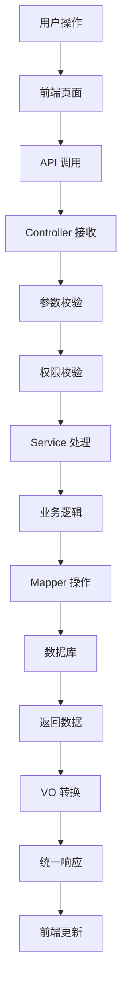

# Notice 模块完整教程 - 理论+实战全攻略

## 🎯 教程概述

这是一个从零开始的完整教程，既有详细的理论解释，又有完整的实战代码。通过这个教程，你将：

- 🧠 **理解每个概念**：什么是 VO、DO、分层架构等
- 💻 **掌握实战技能**：完整的前后端代码实现
- 🔧 **学会开发流程**：从数据库设计到部署上线
- 🚀 **具备独立能力**：能够开发类似的业务模块

## 📚 目录结构

1. [基础概念详解](#基础概念详解)
2. [项目架构设计](#项目架构设计)
3. [数据库设计实战](#数据库设计实战)
4. [后端开发详解](#后端开发详解)
5. [前端开发实战](#前端开发实战)
6. [完整测试流程](#完整测试流程)
7. [部署上线指南](#部署上线指南)

---

## 📖 基础概念详解

### 🤔 什么是 Notice 模块？

**Notice 模块** 就是一个"通知公告"功能，就像学校里的公告栏一样：
- 管理员可以发布通知（比如系统维护通知）
- 可以修改、删除通知
- 用户可以查看通知列表
- 支持实时推送通知给在线用户

### 🏗️ 什么是分层架构？

想象一个餐厅的运作模式：

```
前端 (用户界面)     ←→  服务员 (Controller)
                        ↓
                    厨师长 (Service)
                        ↓
                    厨师 (Mapper)
                        ↓
                    冰箱 (数据库)
```

- **Controller（服务员）**：接待客人，记录点餐，返回菜品
- **Service（厨师长）**：决定怎么做菜，协调整个流程，处理业务逻辑
- **Mapper（厨师）**：具体执行，从冰箱取食材（操作数据库）
- **数据库（冰箱）**：存储所有的数据

### 🎯 什么是 VO、DO？

**简单理解：**
- **DO (Data Object)**：数据库里的数据，包含所有字段
- **VO (Value Object)**：传输用的数据，只包含需要的字段

**举个例子：**
```java
// DO - 数据库里的完整用户信息
class UserDO {
    private Long id;
    private String username;
    private String password;        // 敏感信息
    private String email;
    private LocalDateTime createTime;
    private LocalDateTime updateTime;
    private String creator;
    private Boolean deleted;        // 内部字段
}

// VO - 返回给前端的用户信息
class UserRespVO {
    private Long id;
    private String username;
    // 不包含密码、删除标记等敏感信息
    private String email;
    private LocalDateTime createTime;
}
```

**为什么要分开？**
1. **安全性**：不暴露敏感信息（如密码、删除标记）
2. **简洁性**：前端只需要必要的数据
3. **灵活性**：可以组合多个表的数据
4. **版本兼容**：API 升级时保持兼容

---

## 🏗️ 项目架构设计

### 📁 完整的项目结构

```
Notice 模块/
├── 后端 (Java)
│   ├── controller/          # 控制器层 - 接收HTTP请求
│   │   ├── NoticeController.java
│   │   └── vo/             # 数据传输对象
│   │       ├── NoticePageReqVO.java    # 分页查询请求
│   │       ├── NoticeRespVO.java       # 响应数据
│   │       └── NoticeSaveReqVO.java    # 保存请求
│   ├── service/            # 服务层 - 业务逻辑处理
│   │   ├── NoticeService.java          # 接口定义
│   │   └── NoticeServiceImpl.java      # 具体实现
│   ├── dal/                # 数据访问层
│   │   ├── dataobject/     # 数据库对象
│   │   │   └── NoticeDO.java
│   │   └── mysql/          # 数据库操作
│   │       └── NoticeMapper.java
│   └── enums/              # 枚举类
│       └── NoticeTypeEnum.java
└── 前端 (Vue 3 + TypeScript)
    ├── api/                # API 接口封装
    │   └── system/notice/index.ts
    └── views/              # 页面组件
        └── system/notice/
            ├── index.vue   # 列表页面
            └── NoticeForm.vue  # 表单弹窗
```

### 🔄 数据流转过程详解



**举个创建通知的例子：**
1. 用户在前端填写表单，点击"保存"
2. 前端调用 `createNotice` API
3. Controller 接收请求，校验参数和权限
4. Service 处理业务逻辑（如数据验证）
5. Mapper 将数据插入数据库
6. 返回新创建的通知 ID
7. 前端收到响应，关闭弹窗，刷新列表

---

## 🗄️ 数据库设计实战

### 📊 表结构设计

```sql
-- 通知公告表
CREATE TABLE `system_notice` (
  `id` bigint NOT NULL AUTO_INCREMENT COMMENT '公告ID',
  `title` varchar(50) NOT NULL COMMENT '公告标题',
  `content` text COMMENT '公告内容',
  `type` tinyint NOT NULL COMMENT '公告类型（1通知 2公告）',
  `status` tinyint NOT NULL DEFAULT '0' COMMENT '公告状态（0正常 1关闭）',
  `creator` varchar(64) DEFAULT '' COMMENT '创建者',
  `create_time` datetime NOT NULL DEFAULT CURRENT_TIMESTAMP COMMENT '创建时间',
  `updater` varchar(64) DEFAULT '' COMMENT '更新者',
  `update_time` datetime NOT NULL DEFAULT CURRENT_TIMESTAMP ON UPDATE CURRENT_TIMESTAMP COMMENT '更新时间',
  `deleted` bit(1) NOT NULL DEFAULT b'0' COMMENT '是否删除',
  `tenant_id` bigint NOT NULL DEFAULT '0' COMMENT '租户编号',
  PRIMARY KEY (`id`)
) ENGINE=InnoDB COMMENT='通知公告表';
```

### 🔍 字段详解

| 字段名 | 类型 | 说明 | 为什么这样设计？ |
|--------|------|------|------------------|
| `id` | bigint | 主键 | 使用 bigint 支持大量数据 |
| `title` | varchar(50) | 标题 | 限制长度避免过长标题 |
| `content` | text | 内容 | 使用 text 支持长文本 |
| `type` | tinyint | 类型 | 1=通知，2=公告，用数字便于扩展 |
| `status` | tinyint | 状态 | 0=禁用，1=启用，便于控制显示 |
| `creator` | varchar(64) | 创建者 | 记录操作人，便于审计 |
| `create_time` | datetime | 创建时间 | 自动记录创建时间 |
| `updater` | varchar(64) | 更新者 | 记录最后修改人 |
| `update_time` | datetime | 更新时间 | 自动更新修改时间 |
| `deleted` | bit(1) | 删除标记 | 逻辑删除，数据不会真正丢失 |
| `tenant_id` | bigint | 租户ID | 支持多租户，数据隔离 |

### 📝 示例数据

```sql
-- 插入测试数据
INSERT INTO `system_notice` VALUES 
(1, '系统维护通知', '系统将于今晚22:00-24:00进行维护，请提前保存工作。', 1, 0, 'admin', '2024-01-15 10:30:00', 'admin', '2024-01-15 10:30:00', 0, 1),
(2, '新功能发布公告', '我们很高兴地宣布新功能已经上线！', 2, 0, 'admin', '2024-01-16 09:00:00', 'admin', '2024-01-16 09:00:00', 0, 1);
```

---

## 🔧 后端开发详解

### 1. 数据对象 (DO) - 数据库实体

```java
/**
 * 通知公告表 - 数据库实体类
 * 
 * 作用：对应数据库表，包含所有字段
 * 特点：包含完整的数据库字段，用于数据持久化
 */
@TableName("system_notice")  // 指定对应的数据库表名
@KeySequence("system_notice_seq")  // 主键序列（Oracle、PostgreSQL等需要）
@Data  // Lombok注解：自动生成getter、setter、toString等方法
@EqualsAndHashCode(callSuper = true)  // 生成equals和hashCode，包含父类字段
public class NoticeDO extends BaseDO {

    /**
     * 公告ID - 主键
     */
    private Long id;
    
    /**
     * 公告标题
     */
    private String title;
    
    /**
     * 公告类型
     * 枚举 {@link NoticeTypeEnum}
     * 1=通知，2=公告
     */
    private Integer type;
    
    /**
     * 公告内容
     */
    private String content;
    
    /**
     * 公告状态
     * 枚举 {@link CommonStatusEnum}
     * 0=禁用，1=启用
     */
    private Integer status;
    
    // 从 BaseDO 继承的字段：
    // private LocalDateTime createTime;    // 创建时间
    // private LocalDateTime updateTime;    // 修改时间
    // private String creator;              // 创建者
    // private String updater;              // 修改者
    // private Boolean deleted;             // 是否删除
    // private Long tenantId;               // 租户ID
}
```

**🔍 关键注解解释：**
- `@TableName`：告诉 MyBatis-Plus 这个类对应哪个数据库表
- `@KeySequence`：用于某些数据库的主键自增（MySQL 不需要）
- `@Data`：Lombok 注解，自动生成常用方法，减少重复代码
- `extends BaseDO`：继承基础字段，包含审计信息

### 2. 枚举类 - 常量定义

```java
/**
 * 通知类型枚举
 * 
 * 作用：定义通知的类型，避免魔法数字
 * 好处：代码更清晰，类型安全，便于维护
 */
@Getter  // Lombok：生成getter方法
@AllArgsConstructor  // Lombok：生成全参构造函数
public enum NoticeTypeEnum {

    NOTICE(1),        // 通知
    ANNOUNCEMENT(2);  // 公告

    /**
     * 类型值
     */
    private final Integer type;
}
```

**🤔 为什么用枚举？**
- **避免魔法数字**：不用记住 1 是什么，2 是什么
- **类型安全**：编译时就能发现错误
- **便于维护**：新增类型只需要加一行
- **代码清晰**：一看就知道有哪些类型

### 3. VO 对象详解 - 数据传输载体

#### 🎯 VO 的作用和分类

**VO (Value Object)** 就像是"信封"，用来在前后端之间传递数据：

```
前端 ──[ReqVO]──> 后端 ──[DO]──> 数据库
前端 <──[RespVO]── 后端 <──[DO]── 数据库
```

**VO 的三大分类：**
1. **ReqVO (请求 VO)**：前端发送给后端的数据
2. **RespVO (响应 VO)**：后端返回给前端的数据
3. **PageReqVO (分页查询 VO)**：分页查询的参数

#### 📝 请求 VO - 接收前端数据

```java
/**
 * 通知公告创建/修改请求 VO
 *
 * 作用：接收前端传递的数据，进行参数校验
 * 特点：包含校验注解，确保数据正确性
 */
@Schema(description = "管理后台 - 通知公告创建/修改 Request VO")
@Data
public class NoticeSaveReqVO {

    @Schema(description = "岗位公告编号", example = "1024")
    private Long id;  // 修改时需要传ID，新增时为null

    @Schema(description = "公告标题", requiredMode = Schema.RequiredMode.REQUIRED, example = "小博主")
    @NotBlank(message = "公告标题不能为空")  // 校验：不能为空
    @Size(max = 50, message = "公告标题不能超过50个字符")  // 校验：长度限制
    private String title;

    @Schema(description = "公告类型", requiredMode = Schema.RequiredMode.REQUIRED, example = "1")
    @NotNull(message = "公告类型不能为空")  // 校验：不能为null
    private Integer type;

    @Schema(description = "公告内容", requiredMode = Schema.RequiredMode.REQUIRED, example = "半生编码")
    private String content;

    @Schema(description = "状态，参见 CommonStatusEnum 枚举类", requiredMode = Schema.RequiredMode.REQUIRED, example = "1")
    private Integer status;
}
```

**🔍 注解详解：**
- `@Schema`：Swagger 文档注解，生成 API 文档
- `@NotBlank`：校验字符串不能为空，不能只有空格
- `@Size`：校验字符串长度
- `@NotNull`：校验值不能为 null

#### 📤 响应 VO - 返回给前端

```java
/**
 * 通知公告信息响应 VO
 *
 * 作用：返回给前端的数据，只包含需要显示的字段
 * 特点：不包含敏感信息，字段经过筛选
 */
@Schema(description = "管理后台 - 通知公告信息 Response VO")
@Data
public class NoticeRespVO {

    @Schema(description = "通知公告序号", requiredMode = Schema.RequiredMode.REQUIRED, example = "1024")
    private Long id;

    @Schema(description = "公告标题", requiredMode = Schema.RequiredMode.REQUIRED, example = "小博主")
    private String title;

    @Schema(description = "公告类型", requiredMode = Schema.RequiredMode.REQUIRED, example = "1")
    private Integer type;

    @Schema(description = "公告内容", requiredMode = Schema.RequiredMode.REQUIRED, example = "半生编码")
    private String content;

    @Schema(description = "状态，参见 CommonStatusEnum 枚举类", requiredMode = Schema.RequiredMode.REQUIRED, example = "1")
    private Integer status;

    @Schema(description = "创建时间", requiredMode = Schema.RequiredMode.REQUIRED, example = "时间戳格式")
    private LocalDateTime createTime;

    // 注意：不包含 updateTime、creator、updater、deleted 等内部字段
}
```

**🤔 为什么 RespVO 字段更少？**
- **安全性**：不暴露内部字段（如 deleted、updater）
- **简洁性**：前端只需要显示相关的数据
- **性能**：减少数据传输量

#### 🔍 分页查询 VO - 查询条件

```java
/**
 * 通知公告分页查询请求 VO
 *
 * 作用：接收分页查询的参数和条件
 * 特点：继承分页参数，包含查询条件
 */
@Schema(description = "管理后台 - 通知公告分页 Request VO")
@Data
@EqualsAndHashCode(callSuper = true)  // 包含父类字段的 equals 和 hashCode
public class NoticePageReqVO extends PageParam {

    @Schema(description = "通知公告名称，模糊匹配", example = "芋道")
    private String title;  // 可选：按标题搜索

    @Schema(description = "展示状态，参见 CommonStatusEnum 枚举类", example = "1")
    private Integer status;  // 可选：按状态筛选

    // 从 PageParam 继承：
    // private Integer pageNo = 1;     // 第几页
    // private Integer pageSize = 10;  // 每页多少条
}
```

**🔍 继承 PageParam 的好处：**
- **复用代码**：不用重复定义分页参数
- **统一标准**：所有分页查询都用相同的参数名
- **便于维护**：分页逻辑统一管理

#### 🆚 DO vs VO 对比实例

```java
// DO - 数据库完整数据
NoticeDO {
    id: 1024,
    title: "系统维护通知",
    type: 1,
    content: "今晚维护",
    status: 1,
    createTime: "2024-01-15 10:30:00",
    updateTime: "2024-01-15 11:00:00",  // 内部字段
    creator: "admin",                    // 内部字段
    updater: "admin",                    // 内部字段
    deleted: false,                      // 内部字段
    tenantId: 1                         // 内部字段
}

// RespVO - 返回给前端的数据
NoticeRespVO {
    id: 1024,
    title: "系统维护通知",
    type: 1,
    content: "今晚维护",
    status: 1,
    createTime: "2024-01-15 10:30:00"
    // 不包含内部字段，保护数据安全
}
```

### 4. 数据访问层 (Mapper) - 数据库操作

```java
/**
 * 通知公告 Mapper 接口
 *
 * 作用：定义数据库操作方法
 * 特点：继承 BaseMapperX，自动获得基础 CRUD 方法
 */
@Mapper  // MyBatis 注解：标记这是一个 Mapper 接口
public interface NoticeMapper extends BaseMapperX<NoticeDO> {

    /**
     * 分页查询通知公告
     *
     * @param reqVO 查询条件
     * @return 分页结果
     */
    default PageResult<NoticeDO> selectPage(NoticePageReqVO reqVO) {
        return selectPage(reqVO, new LambdaQueryWrapperX<NoticeDO>()
                .likeIfPresent(NoticeDO::getTitle, reqVO.getTitle())      // 标题模糊查询
                .eqIfPresent(NoticeDO::getStatus, reqVO.getStatus())      // 状态精确查询
                .orderByDesc(NoticeDO::getId));                           // 按ID降序排列
    }

    // 从 BaseMapperX 继承的方法：
    // insert(entity)           - 插入
    // updateById(entity)       - 根据ID更新
    // deleteById(id)          - 根据ID删除
    // selectById(id)          - 根据ID查询
    // selectList(wrapper)     - 条件查询列表
    // deleteByIds(ids)        - 批量删除
}
```

**🔍 关键知识点：**

**LambdaQueryWrapperX 查询构造器：**
```java
new LambdaQueryWrapperX<NoticeDO>()
    .likeIfPresent(NoticeDO::getTitle, reqVO.getTitle())     // 如果title不为空，添加LIKE查询
    .eqIfPresent(NoticeDO::getStatus, reqVO.getStatus())     // 如果status不为空，添加等于查询
    .orderByDesc(NoticeDO::getId)                            // 按ID降序
```

**常用查询方法：**
- `likeIfPresent()`：模糊查询，相当于 `WHERE title LIKE '%参数%'`
- `eqIfPresent()`：精确查询，相当于 `WHERE status = 参数`
- `orderByDesc()`：降序排列，相当于 `ORDER BY id DESC`

### 5. 服务层 (Service) - 业务逻辑处理

#### 🎯 Service 的作用

Service 层就像餐厅的"厨师长"：
- **协调流程**：决定先做什么，后做什么
- **业务逻辑**：处理复杂的业务规则
- **事务管理**：确保数据一致性
- **异常处理**：处理各种异常情况

#### 📋 Service 接口定义

```java
/**
 * 通知公告 Service 接口
 *
 * 作用：定义业务方法，规范服务层接口
 */
public interface NoticeService {

    /**
     * 创建通知公告
     *
     * @param createReqVO 创建请求VO
     * @return 新创建的通知ID
     */
    Long createNotice(NoticeSaveReqVO createReqVO);

    /**
     * 更新通知公告
     *
     * @param reqVO 更新请求VO
     */
    void updateNotice(NoticeSaveReqVO reqVO);

    /**
     * 删除通知公告
     *
     * @param id 通知ID
     */
    void deleteNotice(Long id);

    /**
     * 批量删除通知公告
     *
     * @param ids 通知ID列表
     */
    void deleteNoticeList(List<Long> ids);

    /**
     * 获得通知公告分页列表
     *
     * @param reqVO 分页查询条件
     * @return 分页结果
     */
    PageResult<NoticeDO> getNoticePage(NoticePageReqVO reqVO);

    /**
     * 获得通知公告详情
     *
     * @param id 通知ID
     * @return 通知详情
     */
    NoticeDO getNotice(Long id);
}
```

#### 🔧 Service 实现类详解

```java
/**
 * 通知公告 Service 实现类
 *
 * 作用：实现具体的业务逻辑
 */
@Service  // Spring注解：标记这是一个服务类
public class NoticeServiceImpl implements NoticeService {

    @Resource  // 自动注入 Mapper
    private NoticeMapper noticeMapper;

    @Override
    public Long createNotice(NoticeSaveReqVO createReqVO) {
        // 1. 将 VO 转换成 DO
        NoticeDO notice = BeanUtils.toBean(createReqVO, NoticeDO.class);

        // 2. 插入数据库
        noticeMapper.insert(notice);

        // 3. 返回自动生成的 ID
        return notice.getId();
    }

    @Override
    public void updateNotice(NoticeSaveReqVO updateReqVO) {
        // 1. 校验通知是否存在
        validateNoticeExists(updateReqVO.getId());

        // 2. 将 VO 转换成 DO
        NoticeDO updateObj = BeanUtils.toBean(updateReqVO, NoticeDO.class);

        // 3. 更新数据库
        noticeMapper.updateById(updateObj);
    }

    @Override
    public void deleteNotice(Long id) {
        // 1. 校验通知是否存在
        validateNoticeExists(id);

        // 2. 删除（逻辑删除，不是真删除）
        noticeMapper.deleteById(id);
    }

    @Override
    public void deleteNoticeList(List<Long> ids) {
        // 批量删除，不校验是否存在（提高性能）
        noticeMapper.deleteByIds(ids);
    }

    @Override
    public PageResult<NoticeDO> getNoticePage(NoticePageReqVO reqVO) {
        // 直接调用 Mapper 的分页查询方法
        return noticeMapper.selectPage(reqVO);
    }

    @Override
    public NoticeDO getNotice(Long id) {
        // 根据 ID 查询单个记录
        return noticeMapper.selectById(id);
    }

    /**
     * 校验通知是否存在
     *
     * @param id 通知ID
     */
    @VisibleForTesting  // 标记为测试可见，便于单元测试
    public void validateNoticeExists(Long id) {
        if (id == null) {
            return;  // ID 为空，不校验
        }
        NoticeDO notice = noticeMapper.selectById(id);
        if (notice == null) {
            throw exception(NOTICE_NOT_FOUND);  // 抛出业务异常
        }
    }
}
```

**🔍 关键知识点：**

**BeanUtils.toBean() 对象转换：**
```java
// 将 VO 转换成 DO
NoticeDO notice = BeanUtils.toBean(createReqVO, NoticeDO.class);

// 相当于手动赋值：
NoticeDO notice = new NoticeDO();
notice.setTitle(createReqVO.getTitle());
notice.setType(createReqVO.getType());
notice.setContent(createReqVO.getContent());
notice.setStatus(createReqVO.getStatus());
```

**业务校验的重要性：**
- **数据完整性**：确保操作的数据存在
- **用户体验**：提供友好的错误提示
- **系统稳定性**：避免空指针异常

### 6. 控制器层 (Controller) - HTTP 接口

#### 🎯 Controller 的作用

Controller 就像餐厅的"服务员"：
- **接待客人**：接收 HTTP 请求
- **记录点餐**：解析请求参数
- **传达需求**：调用 Service 处理业务
- **上菜服务**：返回处理结果

#### 🔧 Controller 完整实现

```java
/**
 * 通知公告 REST 控制器
 *
 * 作用：提供 HTTP API 接口，处理前端请求
 */
@Tag(name = "管理后台 - 通知公告")  // Swagger 文档分组
@RestController  // REST 控制器，返回 JSON 数据
@RequestMapping("/system/notice")  // 基础路径
@Validated  // 开启参数校验
public class NoticeController {

    @Resource
    private NoticeService noticeService;

    @Resource
    private WebSocketSenderApi webSocketSenderApi;  // WebSocket 推送服务

    /**
     * 创建通知公告
     */
    @PostMapping("/create")
    @Operation(summary = "创建通知公告")  // Swagger 文档
    @PreAuthorize("@ss.hasPermission('system:notice:create')")  // 权限校验
    public CommonResult<Long> createNotice(@Valid @RequestBody NoticeSaveReqVO createReqVO) {
        // 调用 Service 创建通知
        Long noticeId = noticeService.createNotice(createReqVO);
        // 返回统一响应格式
        return success(noticeId);
    }

    /**
     * 修改通知公告
     */
    @PutMapping("/update")
    @Operation(summary = "修改通知公告")
    @PreAuthorize("@ss.hasPermission('system:notice:update')")
    public CommonResult<Boolean> updateNotice(@Valid @RequestBody NoticeSaveReqVO updateReqVO) {
        noticeService.updateNotice(updateReqVO);
        return success(true);
    }

    /**
     * 删除通知公告
     */
    @DeleteMapping("/delete")
    @Operation(summary = "删除通知公告")
    @Parameter(name = "id", description = "编号", required = true, example = "1024")
    @PreAuthorize("@ss.hasPermission('system:notice:delete')")
    public CommonResult<Boolean> deleteNotice(@RequestParam("id") Long id) {
        noticeService.deleteNotice(id);
        return success(true);
    }

    /**
     * 批量删除通知公告
     */
    @DeleteMapping("/delete-list")
    @Operation(summary = "批量删除通知公告")
    @Parameter(name = "ids", description = "编号列表", required = true)
    @PreAuthorize("@ss.hasPermission('system:notice:delete')")
    public CommonResult<Boolean> deleteNoticeList(@RequestParam("ids") List<Long> ids) {
        noticeService.deleteNoticeList(ids);
        return success(true);
    }

    /**
     * 获取通知公告分页列表
     */
    @GetMapping("/page")
    @Operation(summary = "获取通知公告列表")
    @PreAuthorize("@ss.hasPermission('system:notice:query')")
    public CommonResult<PageResult<NoticeRespVO>> getNoticePage(@Validated NoticePageReqVO pageReqVO) {
        // 1. 调用 Service 查询数据
        PageResult<NoticeDO> pageResult = noticeService.getNoticePage(pageReqVO);
        // 2. 将 DO 转换成 VO 返回
        return success(BeanUtils.toBean(pageResult, NoticeRespVO.class));
    }

    /**
     * 获得通知公告详情
     */
    @GetMapping("/get")
    @Operation(summary = "获得通知公告")
    @Parameter(name = "id", description = "编号", required = true, example = "1024")
    @PreAuthorize("@ss.hasPermission('system:notice:query')")
    public CommonResult<NoticeRespVO> getNotice(@RequestParam("id") Long id) {
        // 1. 调用 Service 查询数据
        NoticeDO notice = noticeService.getNotice(id);
        // 2. 将 DO 转换成 VO 返回
        return success(BeanUtils.toBean(notice, NoticeRespVO.class));
    }

    /**
     * 推送通知公告
     */
    @PostMapping("/push")
    @Operation(summary = "推送通知公告", description = "只发送给 websocket 连接在线的用户")
    @Parameter(name = "id", description = "编号", required = true, example = "1024")
    @PreAuthorize("@ss.hasPermission('system:notice:update')")
    public CommonResult<Boolean> push(@RequestParam("id") Long id) {
        // 1. 获取通知详情
        NoticeDO notice = noticeService.getNotice(id);
        Assert.notNull(notice, "公告不能为空");

        // 2. 通过 WebSocket 推送给在线用户
        webSocketSenderApi.sendObject(UserTypeEnum.ADMIN.getValue(), "notice-push", notice);

        return success(true);
    }
}
```

#### 🔍 关键注解详解

**类级别注解：**
```java
@Tag(name = "管理后台 - 通知公告")  // Swagger 文档分组标签
@RestController                    // = @Controller + @ResponseBody
@RequestMapping("/system/notice")  // 所有方法的基础路径
@Validated                        // 开启方法参数校验
```

**方法级别注解：**
```java
@PostMapping("/create")                                    // 处理 POST 请求
@Operation(summary = "创建通知公告")                        // Swagger 文档描述
@PreAuthorize("@ss.hasPermission('system:notice:create')")  // 权限校验
```

**参数注解：**
```java
@Valid @RequestBody NoticeSaveReqVO createReqVO  // 校验请求体参数
@RequestParam("id") Long id                      // 获取 URL 参数
@Validated NoticePageReqVO pageReqVO            // 校验查询参数
```

#### 🔄 完整的请求处理流程

以创建通知为例：

```
1. 前端发送请求
   POST /system/notice/create
   Body: {"title":"通知","type":1,"content":"内容","status":1}

2. Spring 接收请求
   - 路由到 NoticeController.createNotice()
   - 检查权限：@PreAuthorize
   - 解析参数：@RequestBody -> NoticeSaveReqVO
   - 校验参数：@Valid 触发校验注解

3. Controller 处理
   - 调用 noticeService.createNotice(createReqVO)
   - 获取返回的 noticeId
   - 包装成 CommonResult 返回

4. 前端收到响应
   {"code":0,"msg":"操作成功","data":1024}
```

#### 🛡️ 权限控制详解

```java
@PreAuthorize("@ss.hasPermission('system:notice:create')")
```

**权限字符串格式：**
- `system`：模块名
- `notice`：功能名
- `create`：操作名

**常用权限操作：**
- `create`：创建权限
- `update`：修改权限
- `delete`：删除权限
- `query`：查询权限

**权限校验流程：**
1. 获取当前登录用户
2. 查询用户的角色和权限
3. 检查是否包含指定权限
4. 有权限：继续执行，无权限：返回 403 错误

---

## 🎨 前端开发实战

### 🎯 前端架构设计

前端采用 **Vue 3 + TypeScript + Element Plus** 技术栈：

```
前端架构/
├── api/                    # API 接口层
│   └── system/notice/
│       └── index.ts       # 接口定义和调用
├── views/                 # 页面组件层
│   └── system/notice/
│       ├── index.vue      # 列表页面
│       └── NoticeForm.vue # 表单弹窗
└── types/                 # 类型定义
    └── api.d.ts          # API 相关类型
```

### 1. API 接口层 - 前后端通信桥梁

#### 🔗 接口定义和类型安全

```typescript
// api/system/notice/index.ts - API 接口定义
import request from '@/config/axios'

/**
 * 通知 VO 接口定义
 *
 * 作用：定义前后端数据交互的类型
 * 好处：类型安全，IDE 智能提示，编译时错误检查
 */
export interface NoticeVO {
  id: number | undefined    // 可选的 ID（新增时为 undefined）
  title: string            // 必填标题
  type: number             // 通知类型：1=通知，2=公告
  content: string          // 通知内容
  status: number           // 状态：0=禁用，1=启用
  remark: string           // 备注
  creator: string          // 创建者（后端填充）
  createTime: Date         // 创建时间（后端填充）
}

/**
 * 分页查询参数接口
 */
export interface NoticePageReqVO {
  pageNo: number           // 第几页
  pageSize: number         // 每页多少条
  title?: string           // 可选：标题搜索
  status?: number          // 可选：状态筛选
}

// ==================== API 函数定义 ====================

/**
 * 查询公告列表
 */
export const getNoticePage = (params: NoticePageReqVO) => {
  return request.get({ url: '/system/notice/page', params })
}

/**
 * 查询公告详情
 */
export const getNotice = (id: number) => {
  return request.get({ url: '/system/notice/get?id=' + id })
}

/**
 * 新增公告
 */
export const createNotice = (data: NoticeVO) => {
  return request.post({ url: '/system/notice/create', data })
}

/**
 * 修改公告
 */
export const updateNotice = (data: NoticeVO) => {
  return request.put({ url: '/system/notice/update', data })
}

/**
 * 删除公告
 */
export const deleteNotice = (id: number) => {
  return request.delete({ url: '/system/notice/delete?id=' + id })
}

/**
 * 批量删除公告
 */
export const deleteNoticeList = (ids: number[]) => {
  return request.delete({
    url: '/system/notice/delete-list',
    params: { ids: ids.join(',') }
  })
}

/**
 * 推送公告
 */
export const pushNotice = (id: number) => {
  return request.post({ url: '/system/notice/push?id=' + id })
}
```

#### 🔍 TypeScript 的优势

**1. 类型安全：**
```typescript
// ❌ JavaScript - 运行时才发现错误
const data = {
    title: "通知",
    type: "1",  // 错误：应该是数字
    content: "内容"
    // 缺少必填字段
}

// ✅ TypeScript - 编译时就发现错误
const data: NoticeVO = {
    id: undefined,
    title: "通知",
    type: 1,        // 正确：数字类型
    content: "内容",
    status: 1,      // 必须包含
    remark: "",
    creator: "",
    createTime: new Date()
}
```

**2. 智能提示：**
```typescript
// 输入 data. 时，IDE 会自动提示所有可用属性
data.title    // ✅ 有提示，知道是 string 类型
data.type     // ✅ 有提示，知道是 number 类型
data.xyz      // ❌ 编译错误，不存在的属性
```

### 2. 列表页面组件 - 数据展示和操作

#### 🎨 完整的列表页面实现

```vue
<!-- views/system/notice/index.vue - 通知公告列表页面 -->
<template>
  <ContentWrap>
    <!-- 搜索工作栏 -->
    <el-form
      class="-mb-15px"
      :model="queryParams"
      ref="queryFormRef"
      :inline="true"
      label-width="68px"
    >
      <!-- 标题搜索 -->
      <el-form-item label="公告标题" prop="title">
        <el-input
          v-model="queryParams.title"
          placeholder="请输入公告标题"
          clearable
          @keyup.enter="handleQuery"
          class="!w-240px"
        />
      </el-form-item>

      <!-- 状态筛选 -->
      <el-form-item label="公告状态" prop="status">
        <el-select
          v-model="queryParams.status"
          placeholder="请选择公告状态"
          clearable
          class="!w-240px"
        >
          <el-option
            v-for="dict in getIntDictOptions(DICT_TYPE.COMMON_STATUS)"
            :key="dict.value"
            :label="dict.label"
            :value="dict.value"
          />
        </el-select>
      </el-form-item>

      <!-- 操作按钮 -->
      <el-form-item>
        <el-button @click="handleQuery">
          <Icon icon="ep:search" class="mr-5px" /> 搜索
        </el-button>
        <el-button @click="resetQuery">
          <Icon icon="ep:refresh" class="mr-5px" /> 重置
        </el-button>
        <el-button
          type="primary"
          plain
          @click="openForm('create')"
          v-hasPermi="['system:notice:create']"
        >
          <Icon icon="ep:plus" class="mr-5px" /> 新增
        </el-button>
        <el-button
          type="danger"
          plain
          :disabled="checkedIds.length === 0"
          @click="handleDeleteBatch"
          v-hasPermi="['system:notice:delete']"
        >
          <Icon icon="ep:delete" class="mr-5px" /> 批量删除
        </el-button>
      </el-form-item>
    </el-form>
  </ContentWrap>

  <!-- 数据列表 -->
  <ContentWrap>
    <el-table
      v-loading="loading"
      :data="list"
      @selection-change="handleRowCheckboxChange"
    >
      <!-- 选择框 -->
      <el-table-column type="selection" width="55" />

      <!-- 公告编号 -->
      <el-table-column label="公告编号" align="center" prop="id" />

      <!-- 公告标题 -->
      <el-table-column label="公告标题" align="center" prop="title" />

      <!-- 公告类型 -->
      <el-table-column label="公告类型" align="center" prop="type">
        <template #default="scope">
          <dict-tag :type="DICT_TYPE.SYSTEM_NOTICE_TYPE" :value="scope.row.type" />
        </template>
      </el-table-column>

      <!-- 状态 -->
      <el-table-column label="状态" align="center" prop="status">
        <template #default="scope">
          <dict-tag :type="DICT_TYPE.COMMON_STATUS" :value="scope.row.status" />
        </template>
      </el-table-column>

      <!-- 创建时间 -->
      <el-table-column
        label="创建时间"
        align="center"
        prop="createTime"
        width="180"
        :formatter="dateFormatter"
      />

      <!-- 操作列 -->
      <el-table-column label="操作" align="center">
        <template #default="scope">
          <el-button
            link
            type="primary"
            @click="openForm('update', scope.row.id)"
            v-hasPermi="['system:notice:update']"
          >
            编辑
          </el-button>
          <el-button
            link
            type="danger"
            @click="handleDelete(scope.row.id)"
            v-hasPermi="['system:notice:delete']"
          >
            删除
          </el-button>
          <el-button
            link
            @click="handlePush(scope.row.id)"
            v-hasPermi="['system:notice:update']"
          >
            推送
          </el-button>
        </template>
      </el-table-column>
    </el-table>

    <!-- 分页组件 -->
    <Pagination
      :total="total"
      v-model:page="queryParams.pageNo"
      v-model:limit="queryParams.pageSize"
      @pagination="getList"
    />
  </ContentWrap>

  <!-- 表单弹窗：添加/修改 -->
  <NoticeForm ref="formRef" @success="getList" />
</template>

<script lang="ts" setup>
// ==================== 导入依赖 ====================
import { DICT_TYPE, getIntDictOptions } from '@/utils/dict'
import { dateFormatter } from '@/utils/formatTime'
import * as NoticeApi from '@/api/system/notice'
import NoticeForm from './NoticeForm.vue'

// ==================== 组件配置 ====================
defineOptions({ name: 'SystemNotice' })

// ==================== 响应式数据 ====================
const message = useMessage() // 消息弹窗
const { t } = useI18n() // 国际化

const loading = ref(true) // 列表的加载中状态
const total = ref(0) // 列表的总页数
const list = ref<NoticeApi.NoticeVO[]>([]) // 列表的数据

// 查询参数
const queryParams = reactive({
  pageNo: 1,        // 当前页码
  pageSize: 10,     // 每页条数
  title: '',        // 标题搜索
  type: undefined,  // 类型筛选
  status: undefined // 状态筛选
})

const queryFormRef = ref() // 搜索表单的引用

// ==================== 核心功能方法 ====================

/**
 * 查询公告列表
 *
 * 作用：从后端获取分页数据并更新页面
 */
const getList = async () => {
  loading.value = true
  try {
    // 调用 API 获取数据
    const data = await NoticeApi.getNoticePage(queryParams)
    list.value = data.list
    total.value = data.total
  } finally {
    loading.value = false
  }
}

/**
 * 搜索按钮操作
 *
 * 作用：重置到第一页并重新查询
 */
const handleQuery = () => {
  queryParams.pageNo = 1  // 重置到第一页
  getList()
}

/**
 * 重置按钮操作
 *
 * 作用：清空搜索条件并重新查询
 */
const resetQuery = () => {
  queryFormRef.value.resetFields()  // 重置表单
  handleQuery()
}

// ==================== 表单操作 ====================

const formRef = ref() // 表单弹窗的引用

/**
 * 打开表单弹窗
 *
 * @param type 操作类型：'create' | 'update'
 * @param id 记录ID（修改时需要）
 */
const openForm = (type: string, id?: number) => {
  formRef.value.open(type, id)
}

// ==================== 删除操作 ====================

/**
 * 删除单条记录
 *
 * @param id 记录ID
 */
const handleDelete = async (id: number) => {
  try {
    // 删除的二次确认
    await message.delConfirm()
    // 发起删除请求
    await NoticeApi.deleteNotice(id)
    message.success(t('common.delSuccess'))
    // 刷新列表
    await getList()
  } catch {
    // 用户取消删除，不做处理
  }
}

/**
 * 批量删除操作
 */
const checkedIds = ref<number[]>([]) // 选中的记录ID列表

// 处理表格行选择变化
const handleRowCheckboxChange = (rows: NoticeApi.NoticeVO[]) => {
  checkedIds.value = rows.map((row) => row.id!)
}

// 批量删除处理
const handleDeleteBatch = async () => {
  try {
    // 删除的二次确认
    await message.delConfirm()
    // 发起批量删除请求
    await NoticeApi.deleteNoticeList(checkedIds.value)
    message.success(t('common.delSuccess'))
    // 刷新列表
    await getList()
  } catch {
    // 用户取消删除，不做处理
  }
}

// ==================== 推送操作 ====================

/**
 * 推送通知
 *
 * @param id 通知ID
 */
const handlePush = async (id: number) => {
  try {
    // 推送的二次确认
    await message.confirm('是否推送所选中通知？')
    // 发起推送请求
    await NoticeApi.pushNotice(id)
    message.success('推送成功')
  } catch {
    // 用户取消推送，不做处理
  }
}

// ==================== 生命周期 ====================

/**
 * 组件挂载时初始化数据
 */
onMounted(() => {
  getList()
})
</script>
```

#### 🔍 Vue 3 Composition API 详解

**响应式数据定义：**
```typescript
const loading = ref(true)                    // 基础类型用 ref
const list = ref<NoticeApi.NoticeVO[]>([])   // 数组用 ref + 泛型
const queryParams = reactive({               // 对象用 reactive
  pageNo: 1,
  pageSize: 10
})
```

**异步函数处理：**
```typescript
const getList = async () => {
  loading.value = true  // 显示加载状态
  try {
    const data = await NoticeApi.getNoticePage(queryParams)
    list.value = data.list
    total.value = data.total
  } finally {
    loading.value = false  // 无论成功失败都隐藏加载状态
  }
}
```

**事件处理：**
```typescript
// 搜索
const handleQuery = () => {
  queryParams.pageNo = 1  // 重置页码
  getList()               // 重新查询
}

// 删除确认
const handleDelete = async (id: number) => {
  try {
    await message.delConfirm()  // 等待用户确认
    await NoticeApi.deleteNotice(id)
    message.success('删除成功')
    await getList()  // 刷新列表
  } catch {
    // 用户取消或删除失败，不做处理
  }
}
```

### 3. 表单弹窗组件 - 数据编辑

#### 🎨 表单组件完整实现

```vue
<!-- views/system/notice/NoticeForm.vue - 通知公告表单弹窗 -->
<template>
  <Dialog v-model="dialogVisible" :title="dialogTitle" width="800">
    <el-form
      ref="formRef"
      v-loading="formLoading"
      :model="formData"
      :rules="formRules"
      label-width="80px"
    >
      <!-- 公告标题 -->
      <el-form-item label="公告标题" prop="title">
        <el-input v-model="formData.title" placeholder="请输入公告标题" />
      </el-form-item>

      <!-- 公告内容 -->
      <el-form-item label="公告内容" prop="content">
        <Editor v-model="formData.content" height="150px" />
      </el-form-item>

      <!-- 公告类型 -->
      <el-form-item label="公告类型" prop="type">
        <el-select v-model="formData.type" clearable placeholder="请选择公告类型">
          <el-option
            v-for="dict in getIntDictOptions(DICT_TYPE.SYSTEM_NOTICE_TYPE)"
            :key="parseInt(dict.value as any)"
            :label="dict.label"
            :value="parseInt(dict.value as any)"
          />
        </el-select>
      </el-form-item>

      <!-- 状态 -->
      <el-form-item label="状态" prop="status">
        <el-select v-model="formData.status" clearable placeholder="请选择状态">
          <el-option
            v-for="dict in getIntDictOptions(DICT_TYPE.COMMON_STATUS)"
            :key="parseInt(dict.value as any)"
            :label="dict.label"
            :value="parseInt(dict.value as any)"
          />
        </el-select>
      </el-form-item>

      <!-- 备注 -->
      <el-form-item label="备注" prop="remark">
        <el-input v-model="formData.remark" placeholder="请输备注" type="textarea" />
      </el-form-item>
    </el-form>

    <!-- 弹窗底部按钮 -->
    <template #footer>
      <el-button :disabled="formLoading" type="primary" @click="submitForm">确 定</el-button>
      <el-button @click="dialogVisible = false">取 消</el-button>
    </template>
  </Dialog>
</template>

<script lang="ts" setup>
// ==================== 导入依赖 ====================
import { DICT_TYPE, getIntDictOptions } from '@/utils/dict'
import { CommonStatusEnum } from '@/utils/constants'
import * as NoticeApi from '@/api/system/notice'

// ==================== 组件配置 ====================
defineOptions({ name: 'SystemNoticeForm' })

const { t } = useI18n() // 国际化
const message = useMessage() // 消息弹窗

// ==================== 响应式数据 ====================
const dialogVisible = ref(false) // 弹窗的是否展示
const dialogTitle = ref('') // 弹窗的标题
const formLoading = ref(false) // 表单的加载中：1）修改时的数据加载；2）提交的按钮禁用
const formType = ref('') // 表单的类型：create - 新增；update - 修改

// 表单数据
const formData = ref({
  id: undefined,
  title: '',
  type: undefined,
  content: '',
  status: CommonStatusEnum.ENABLE,  // 默认启用
  remark: ''
})

// 表单校验规则
const formRules = reactive({
  title: [{ required: true, message: '公告标题不能为空', trigger: 'blur' }],
  type: [{ required: true, message: '公告类型不能为空', trigger: 'change' }],
  status: [{ required: true, message: '状态不能为空', trigger: 'change' }],
  content: [{ required: true, message: '公告内容不能为空', trigger: 'blur' }]
})

const formRef = ref() // 表单 Ref

// ==================== 核心功能方法 ====================

/**
 * 打开弹窗
 *
 * @param type 操作类型：'create' | 'update'
 * @param id 记录ID（修改时需要）
 */
const open = async (type: string, id?: number) => {
  dialogVisible.value = true
  dialogTitle.value = t('action.' + type)  // 国际化标题
  formType.value = type
  resetForm()  // 重置表单

  // 修改时，设置数据
  if (id) {
    formLoading.value = true
    try {
      formData.value = await NoticeApi.getNotice(id)
    } finally {
      formLoading.value = false
    }
  }
}

// 暴露 open 方法，供父组件调用
defineExpose({ open })

/**
 * 提交表单
 */
const emit = defineEmits(['success']) // 定义 success 事件，用于操作成功后的回调

const submitForm = async () => {
  // 校验表单
  if (!formRef) return
  const valid = await formRef.value.validate()
  if (!valid) return

  // 提交请求
  formLoading.value = true
  try {
    const data = formData.value as unknown as NoticeApi.NoticeVO
    if (formType.value === 'create') {
      await NoticeApi.createNotice(data)
      message.success(t('common.createSuccess'))
    } else {
      await NoticeApi.updateNotice(data)
      message.success(t('common.updateSuccess'))
    }
    dialogVisible.value = false
    // 发送操作成功的事件，通知父组件刷新列表
    emit('success')
  } finally {
    formLoading.value = false
  }
}

/**
 * 重置表单
 */
const resetForm = () => {
  formData.value = {
    id: undefined,
    title: '',
    type: undefined,
    content: '',
    status: CommonStatusEnum.ENABLE,
    remark: ''
  }
  formRef.value?.resetFields()
}
</script>
```

#### 🔍 表单组件关键知识点

**弹窗控制：**
```typescript
const dialogVisible = ref(false)  // 控制弹窗显示/隐藏
const dialogTitle = ref('')       // 动态设置弹窗标题
```

**表单校验：**
```typescript
const formRules = reactive({
  title: [{ required: true, message: '公告标题不能为空', trigger: 'blur' }],
  type: [{ required: true, message: '公告类型不能为空', trigger: 'change' }]
})

// 提交时校验
const valid = await formRef.value.validate()
if (!valid) return  // 校验失败，不提交
```

**父子组件通信：**
```typescript
// 子组件暴露方法给父组件调用
defineExpose({ open })

// 子组件向父组件发送事件
const emit = defineEmits(['success'])
emit('success')  // 通知父组件刷新列表
```

---

## 🧪 完整测试流程

### 1. 后端 API 测试 (Postman)

#### 📝 测试环境准备

```bash
# 1. 启动后端服务
java -jar yudao-server.jar

# 2. 获取访问令牌
POST http://localhost:8080/admin-api/system/auth/login
{
    "username": "admin",
    "password": "admin123"
}

# 3. 复制返回的 accessToken，用于后续请求
```

#### 🔧 API 测试用例

**创建通知：**
```http
POST http://localhost:8080/admin-api/system/notice/create
Content-Type: application/json
Authorization: Bearer your-access-token

{
    "title": "系统维护通知",
    "type": 1,
    "content": "系统将于今晚22:00-24:00进行维护，请提前保存工作。",
    "status": 1
}
```

**预期响应：**
```json
{
    "code": 0,
    "msg": "操作成功",
    "data": 1024
}
```

**查询通知列表：**
```http
GET http://localhost:8080/admin-api/system/notice/page?pageNo=1&pageSize=10&title=维护&status=1
Authorization: Bearer your-access-token
```

**修改通知：**
```http
PUT http://localhost:8080/admin-api/system/notice/update
Content-Type: application/json
Authorization: Bearer your-access-token

{
    "id": 1024,
    "title": "系统维护通知（已修改）",
    "type": 1,
    "content": "维护时间调整为今晚23:00-01:00",
    "status": 1
}
```

**删除通知：**
```http
DELETE http://localhost:8080/admin-api/system/notice/delete?id=1024
Authorization: Bearer your-access-token
```

**批量删除：**
```http
DELETE http://localhost:8080/admin-api/system/notice/delete-list?ids=1024,1025,1026
Authorization: Bearer your-access-token
```

**推送通知：**
```http
POST http://localhost:8080/admin-api/system/notice/push?id=1024
Authorization: Bearer your-access-token
```

### 2. 前端功能测试

#### 🎯 测试环境准备

```bash
# 1. 启动前端项目
cd yudao-ui-admin-vue3
npm install
npm run dev

# 2. 访问页面
http://localhost:3000/system/notice

# 3. 登录系统
用户名：admin
密码：admin123
```

#### ✅ 功能测试清单

**列表功能测试：**
- [ ] 页面正常加载，显示通知列表
- [ ] 分页功能正常工作（上一页、下一页、跳转页码）
- [ ] 搜索功能：按标题模糊搜索
- [ ] 筛选功能：按状态筛选（启用/禁用）
- [ ] 重置功能：清空搜索条件并重新查询

**新增功能测试：**
- [ ] 点击"新增"按钮，弹出表单弹窗
- [ ] 表单校验：标题、类型、内容必填
- [ ] 富文本编辑器正常工作
- [ ] 提交成功后关闭弹窗并刷新列表
- [ ] 提交失败时显示错误信息

**修改功能测试：**
- [ ] 点击"编辑"按钮，弹出表单弹窗
- [ ] 表单自动填充现有数据
- [ ] 修改数据后提交成功
- [ ] 列表数据实时更新

**删除功能测试：**
- [ ] 单个删除：点击"删除"按钮，确认后删除成功
- [ ] 批量删除：选中多条记录，点击"批量删除"
- [ ] 删除确认弹窗正常显示
- [ ] 取消删除功能正常

**推送功能测试：**
- [ ] 点击"推送"按钮，确认后推送成功
- [ ] WebSocket 连接的用户能收到推送消息
- [ ] 推送失败时显示错误信息

**权限控制测试：**
- [ ] 无权限用户看不到对应按钮
- [ ] 无权限访问 API 返回 403 错误
- [ ] 权限正常的用户可以正常操作

---

## 🚀 部署上线指南

### 1. 后端部署

#### 📦 Maven 打包

```bash
# 在项目根目录执行
mvn clean package -Dmaven.test.skip=true

# 打包完成后，在 target 目录下会生成 jar 包
ls target/*.jar
```

#### 🏃 运行部署

```bash
# 直接运行
java -jar yudao-server.jar

# 指定配置文件
java -jar yudao-server.jar --spring.profiles.active=prod

# 后台运行
nohup java -jar yudao-server.jar > app.log 2>&1 &
```

#### 🐳 Docker 部署

```dockerfile
# Dockerfile
FROM openjdk:8-jre-slim

# 设置工作目录
WORKDIR /app

# 复制 jar 包
COPY target/yudao-server.jar app.jar

# 暴露端口
EXPOSE 8080

# 启动命令
ENTRYPOINT ["java", "-jar", "app.jar"]
```

```bash
# 构建镜像
docker build -t yudao-server .

# 运行容器
docker run -d -p 8080:8080 --name yudao-server yudao-server
```

### 2. 前端部署

#### 📦 npm 打包

```bash
# 安装依赖
npm install

# 打包生产环境
npm run build:prod

# 打包完成后，在 dist 目录下会生成静态文件
ls dist/
```

#### 🌐 Nginx 配置

```nginx
# /etc/nginx/sites-available/yudao
server {
    listen 80;
    server_name your-domain.com;

    # 前端静态文件
    location / {
        root /usr/share/nginx/html;
        index index.html;
        try_files $uri $uri/ /index.html;
    }

    # 后端 API 代理
    location /admin-api/ {
        proxy_pass http://backend-server:8080/admin-api/;
        proxy_set_header Host $host;
        proxy_set_header X-Real-IP $remote_addr;
        proxy_set_header X-Forwarded-For $proxy_add_x_forwarded_for;
        proxy_set_header X-Forwarded-Proto $scheme;
    }

    # WebSocket 代理
    location /websocket/ {
        proxy_pass http://backend-server:8080/websocket/;
        proxy_http_version 1.1;
        proxy_set_header Upgrade $http_upgrade;
        proxy_set_header Connection "upgrade";
    }
}
```

#### 🔧 部署脚本

```bash
#!/bin/bash
# deploy.sh - 自动化部署脚本

echo "开始部署前端..."

# 1. 拉取最新代码
git pull origin main

# 2. 安装依赖
npm install

# 3. 打包
npm run build:prod

# 4. 备份旧版本
sudo mv /usr/share/nginx/html /usr/share/nginx/html.bak.$(date +%Y%m%d_%H%M%S)

# 5. 部署新版本
sudo cp -r dist /usr/share/nginx/html

# 6. 重启 Nginx
sudo systemctl reload nginx

echo "部署完成！"
```

### 3. 数据库部署

#### 📊 生产环境配置

```yaml
# application-prod.yml
spring:
  datasource:
    url: jdbc:mysql://prod-db-server:3306/ruoyi_vue_pro?useSSL=true&serverTimezone=Asia/Shanghai
    username: ${DB_USERNAME}
    password: ${DB_PASSWORD}

  redis:
    host: prod-redis-server
    port: 6379
    password: ${REDIS_PASSWORD}

# 日志配置
logging:
  level:
    cn.iocoder.yudao: INFO
  file:
    name: /var/log/yudao/app.log
```

#### 🔐 环境变量配置

```bash
# .env 文件
DB_USERNAME=your_db_user
DB_PASSWORD=your_db_password
REDIS_PASSWORD=your_redis_password
JWT_SECRET=your_jwt_secret
```

---

## 🎯 学习总结

### 🏆 你学到了什么？

#### 🔧 后端技能
- **Spring Boot 项目结构**：理解分层架构的设计思想
- **MyBatis-Plus 使用**：掌握 ORM 框架的基本操作
- **VO/DO 设计模式**：学会数据传输对象的设计
- **RESTful API 设计**：掌握标准的 API 接口设计
- **参数校验和异常处理**：确保数据安全和系统稳定
- **权限控制机制**：理解企业级权限管理

#### 🎨 前端技能
- **Vue 3 + TypeScript**：掌握现代前端开发技术
- **Element Plus 组件库**：学会使用 UI 组件库
- **API 接口封装**：理解前后端数据交互
- **表单处理和校验**：掌握用户输入处理
- **列表分页和搜索**：实现数据展示功能
- **组件化开发思想**：提高代码复用性

#### 🔄 全栈技能
- **前后端数据流转**：理解完整的数据处理流程
- **项目部署上线**：掌握生产环境部署
- **测试和调试**：学会系统性测试方法
- **问题排查能力**：具备独立解决问题的能力

### 🚀 下一步学习建议

#### 🌱 初学者路径
1. **巩固基础**：
   - 照着教程完整实现一遍 Notice 模块
   - 理解每个注解和方法的作用
   - 掌握基本的 CRUD 操作

2. **举一反三**：
   - 开发"用户管理"模块
   - 开发"角色管理"模块
   - 尝试添加新字段和功能

3. **深入学习**：
   - 学习 Spring Security 权限控制
   - 学习 Redis 缓存使用
   - 学习事务管理和并发控制

#### 🚀 进阶学习路径
1. **架构设计**：
   - 微服务架构设计
   - 分布式系统开发
   - 高并发系统优化

2. **技术深度**：
   - JVM 调优和监控
   - 数据库性能优化
   - 前端性能优化

3. **工程实践**：
   - DevOps 和 CI/CD
   - 监控和日志系统
   - 代码质量管理

### 💡 实战项目建议

#### 🎯 练手项目
1. **博客系统**：文章管理、评论系统、用户中心
2. **电商系统**：商品管理、订单处理、支付集成
3. **OA 系统**：工作流、审批流程、文档管理

#### 🏢 企业级项目
1. **CRM 系统**：客户关系管理
2. **ERP 系统**：企业资源规划
3. **物流系统**：仓储管理、配送跟踪

### 🎉 恭喜你！

通过这个完整的教程，你已经：

✅ **理解了企业级项目的开发模式**
✅ **掌握了前后端全栈开发技能**
✅ **学会了标准的 CRUD 操作**
✅ **具备了独立开发业务模块的能力**
✅ **了解了项目部署和上线流程**

现在你可以：
- 🔧 **独立开发**类似的业务模块
- 📖 **理解和维护**现有的企业级代码
- 👥 **参与团队协作**开发项目
- 🚀 **继续深入学习**更高级的技术

### 📚 推荐学习资源

#### 📖 官方文档
- [Spring Boot 官方文档](https://spring.io/projects/spring-boot)
- [Vue 3 官方文档](https://vuejs.org/)
- [TypeScript 官方文档](https://www.typescriptlang.org/)
- [Element Plus 官方文档](https://element-plus.org/)

#### 🎥 视频教程
- 芋道源码的 B 站教程
- Vue 3 + TypeScript 实战教程
- Spring Boot 企业级开发教程

#### 💻 实战项目
- [芋道管理系统](https://github.com/YunaiV/ruoyi-vue-pro)
- [若依管理系统](https://github.com/yangzongzhuan/RuoYi-Vue)
- [Vben Admin](https://github.com/vbenjs/vue-vben-admin)

---

## 🎊 结语

**编程是一门实践的艺术！**

这个教程给了你一个完整的开发框架和思路，但真正的成长来自于：

- 🔨 **多动手实践**：理论再好，不如亲自写代码
- 🤔 **多思考总结**：每个功能背后的设计思想
- 🐛 **多解决问题**：在解决 bug 中成长
- 👥 **多交流学习**：和其他开发者交流经验

**记住：每一个大神都是从新手开始的，关键是坚持学习和实践！**

祝你在编程的道路上越走越远，成为一名优秀的全栈开发工程师！🚀

---

*如果这个教程对你有帮助，请给个 ⭐ Star，让更多的人看到！*
