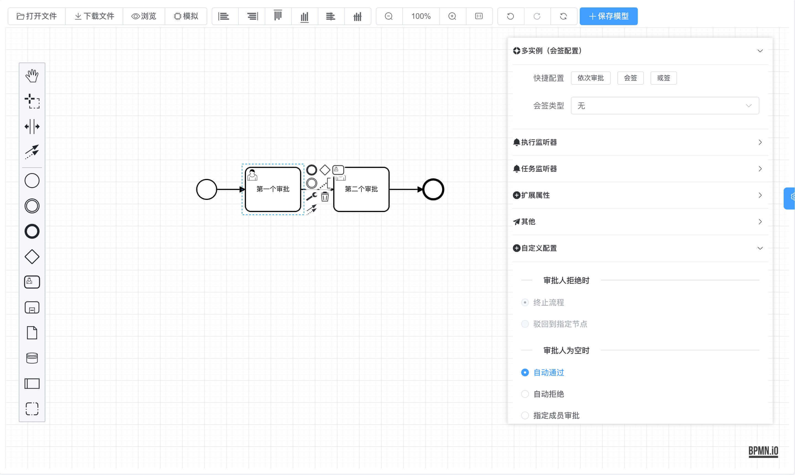
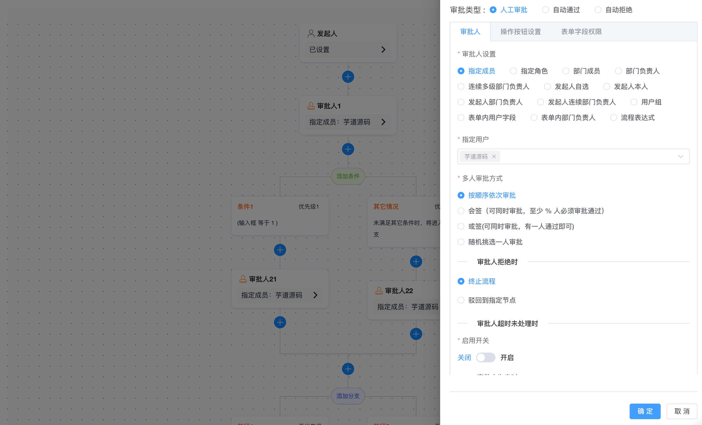

# 严肃声明：现在、未来都不会有商业版本，所有代码全部开源

**「我喜欢写代码，乐此不疲」**  
**「我喜欢做开源，以此为乐」**

我 🐶 在上海艰苦奋斗，早中晚在 top3 大厂认真搬砖，夜里为开源做贡献。

如果这个项目让你有所收获，记得 Star 关注哦，这对我是非常不错的鼓励与支持。

## 🐶 新手必读

- nodejs > 20.12.0 && pnpm > 10.14.0 (强制使用pnpm)
- 演示地址【Vue3 + element-plus】：<http://dashboard-vue3.yudao.iocoder.cn>
- 演示地址【Vue3 + vben5(ant-design-vue)】：<http://dashboard-vben.yudao.iocoder.cn>
- 演示地址【Vue2 + element-ui】：<http://dashboard.yudao.iocoder.cn>
- 启动文档：<https://doc.iocoder.cn/quick-start/>
- 视频教程：<https://doc.iocoder.cn/video/>

## 🐯 平台简介

**芋道**，以开发者为中心，打造中国第一流的快速开发平台，全部开源，个人与企业可 100% 免费使用。

- 采用最新 [vue-vben-admin](https://github.com/vbenjs/vue-vben-admin) v5 实现
- 支持 [Ant Design Vue](https://www.antdv.com/) | [Element Plus](https://element-plus.org/zh-CN/) | [Naive UI](https://www.naiveui.com/) | [TDesign](https://tdesign.tencent.com/) 多种免费开源的中后台模版，具备如下特性：

- **最新技术栈**：使用 Vue3、Vite6 等前端前沿技术开发
- **TypeScript**: 应用程序级 JavaScript 的语言
- **主题**: 提供多套主题色彩，可配置自定义主题
- **国际化**：内置完善的国际化方案
- **权限**：内置完善的动态路由权限生成方案
- **组件**：二次封装了多个常用的组件
- **示例**：内置丰富的示例

## [外包项目请联系【非项目需求请勿扫码，非客服，不解答项目问题】](https://www.shuduokeji.com)

## 技术栈

| 框架 | 说明 | 版本 |
| --- | --- | --- |
| [Vue](https://staging-cn.vuejs.org/) | vue框架 | 3.5.17 |
| [Vite](https://cn.vitejs.dev//) | 开发与构建工具 | 7.1.2 |
| [Ant Design Vue](https://www.antdv.com/) | Ant Design Vue | 4.2.6 |
| [Element Plus](https://element-plus.org/zh-CN/) | Element Plus | 2.10.2 |
| [Naive UI](https://www.naiveui.com/) | Naive UI | 2.42.0 |
| [TDesign](https://tdesign.tencent.com/) | TDesign | 1.17.1 |
| [TypeScript](https://www.typescriptlang.org/docs/) | JavaScript 超集 | 5.8.3 |
| [pinia](https://pinia.vuejs.org/) | Vue 存储库替代 vuex5 | 3.0.3 |
| [vueuse](https://vueuse.org/) | 常用工具集 | 13.4.0 |
| [vue-i18n](https://kazupon.github.io/vue-i18n/zh/introduction.html/) | 国际化 | 11.1.7 |
| [vue-router](https://router.vuejs.org/) | Vue 路由 | 4.5.1 |
| [Tailwind CSS](https://tailwindcss.com/) | 原子 CSS | 3.4.17 |
| [Iconify](https://iconify.design/) | 图标组件 | 5.0.0 |
| [Iconify](https://icon-sets.iconify.design/) | 在线图标库 | 2.2.354 |
| [TinyMCE](https://www.tiny.cloud/) | 富文本编辑器 | 6.1.0 |
| [Echarts](https://echarts.apache.org/) | 图表库 | 5.6.0 |
| [axios](https://axios-http.com/) | http客户端 | 1.10.0 |
| [dayjs](https://day.js.org/) | 日期处理库 | 1.11.13 |
| [vee-validate](https://vee-validate.logaretm.com/) | 表单验证 | 4.15.1 |
| [zod](https://zod.dev/) | 数据验证 | 3.25.67 |

## 🔥 后端架构

支持 Spring Boot、Spring Cloud 两种架构：

① Spring Boot 单体架构：<https://doc.iocoder.cn>

② Spring Cloud 微服务架构：<https://cloud.iocoder.cn>

## 内置功能

系统内置多种多种业务功能，可以用于快速你的业务系统：

系统内置多种多种业务功能，可以用于快速你的业务系统：

- 通用模块（必选）：系统功能、基础设施
- 通用模块（可选）：工作流程、支付系统、数据报表、会员中心
- 业务系统（按需）：ERP 系统、CRM 系统、商城系统、微信公众号、AI 大模型

### 系统功能

|    | 功能    | 描述                              |
|----|-------|---------------------------------|
|    | 用户管理  | 用户是系统操作者，该功能主要完成系统用户配置          |
| ⭐️ | 在线用户  | 当前系统中活跃用户状态监控，支持手动踢下线           |
|    | 角色管理  | 角色菜单权限分配、设置角色按机构进行数据范围权限划分      |
|    | 菜单管理  | 配置系统菜单、操作权限、按钮权限标识等，本地缓存提供性能    |
|    | 部门管理  | 配置系统组织机构（公司、部门、小组），树结构展现支持数据权限  |
|    | 岗位管理  | 配置系统用户所属担任职务                    |
| 🚀 | 租户管理  | 配置系统租户，支持 SaaS 场景下的多租户功能        |
| 🚀 | 租户套餐  | 配置租户套餐，自定每个租户的菜单、操作、按钮的权限       |
|    | 字典管理  | 对系统中经常使用的一些较为固定的数据进行维护          |
| 🚀 | 短信管理  | 短信渠道、短息模板、短信日志，对接阿里云、腾讯云等主流短信平台 |
| 🚀 | 邮件管理  | 邮箱账号、邮件模版、邮件发送日志，支持所有邮件平台       |
| 🚀 | 站内信   | 系统内的消息通知，提供站内信模版、站内信消息          |
| 🚀 | 操作日志  | 系统正常操作日志记录和查询，集成 Swagger 生成日志内容 |
| ⭐️ | 登录日志  | 系统登录日志记录查询，包含登录异常               |
| 🚀 | 错误码管理 | 系统所有错误码的管理，可在线修改错误提示，无需重启服务     |
|    | 通知公告  | 系统通知公告信息发布维护                    |
| 🚀 | 敏感词   | 配置系统敏感词，支持标签分组                  |
| 🚀 | 应用管理  | 管理 SSO 单点登录的应用，支持多种 OAuth2 授权方式 |
| 🚀 | 地区管理  | 展示省份、城市、区镇等城市信息，支持 IP 对应城市      |

### 工作流程

基于 Flowable 构建，可支持信创（国产）数据库，满足中国特色流程操作：

| BPMN 设计器 | 钉钉/飞书设计器 |
| --- | --- |
|  |  |

> 历经头部企业生产验证，工作流引擎须标配仿钉钉/飞书 + BPMN 双设计器！！！
>
> 前者支持轻量配置简单流程，后者实现复杂场景深度编排

| 功能列表       | 功能描述                                                                                | 是否完成 |
|------------|-------------------------------------------------------------------------------------|------|
| SIMPLE 设计器 | 仿钉钉/飞书设计器，支持拖拽搭建表单流程，10 分钟快速完成审批流程配置                                                | ✅    |
| BPMN 设计器   | 基于 BPMN 标准开发，适配复杂业务场景，满足多层级审批及流程自动化需求                                               | ✅    |
| 会签         | 同一个审批节点设置多个人（如 A、B、C 三人，三人会同时收到待办任务），需全部同意之后，审批才可到下一审批节点                            | ✅    |
| 或签         | 同一个审批节点设置多个人，任意一个人处理后，就能进入下一个节点                                                     | ✅    |
| 依次审批       | （顺序会签）同一个审批节点设置多个人（如 A、B、C 三人），三人按顺序依次收到待办，即 A 先审批，A 提交后 B 才能审批，需全部同意之后，审批才可到下一审批节点 | ✅    |
| 抄送         | 将审批结果通知给抄送人，同一个审批默认排重，不重复抄送给同一人                                                     | ✅    |
| 驳回         | （退回）将审批重置发送给某节点，重新审批。可驳回至发起人、上一节点、任意节点                                              | ✅    |
| 转办         | A 转给其 B 审批，B 审批后，进入下一节点                                                             | ✅    |
| 委派         | A 转给其 B 审批，B 审批后，转给 A，A 继续审批后进入下一节点                                                 | ✅    |
| 加签         | 允许当前审批人根据需要，自行增加当前节点的审批人，支持向前、向后加签                                                  | ✅    |
| 减签         | （取消加签）在当前审批人操作之前，减少审批人                                                              | ✅    |
| 撤销         | （取消流程）流程发起人，可以对流程进行撤销处理                                                             | ✅    |
| 终止         | 系统管理员，在任意节点终止流程实例                                                                   | ✅    |
| 表单权限       | 支持拖拉拽配置表单，每个审批节点可配置只读、编辑、隐藏权限                                                       | ✅    |
| 超时审批       | 配置超时审批时间，超时后自动触发审批通过、不通过、驳回等操作                                                      | ✅    |
| 自动提醒       | 配置提醒时间，到达时间后自动触发短信、邮箱、站内信等通知提醒，支持自定义重复提醒频次                                          | ✅    |
| 父子流程       | 主流程设置子流程节点，子流程节点会自动触发子流程。子流程结束后，主流程才会执行（继续往下下执行），支持同步子流程、异步子流程                      | ✅    |
| 条件分支       | （排它分支）用于在流程中实现决策，即根据条件选择一个分支执行                                                      | ✅    |
| 并行分支       | 允许将流程分成多条分支，不进行条件判断，所有分支都会执行                                                        | ✅    |
| 包容分支       | （条件分支 + 并行分支的结合体）允许基于条件选择多条分支执行，但如果没有任何一个分支满足条件，则可以选择默认分支                           | ✅    |
| 路由分支       | 根据条件选择一个分支执行（重定向到指定配置节点），也可以选择默认分支执行（继续往下执行）                                        | ✅    |
| 触发节点       | 执行到该节点，触发 HTTP 请求、HTTP 回调、更新数据、删除数据等                                                | ✅    |
| 延迟节点       | 执行到该节点，审批等待一段时间再执行，支持固定时长、固定日期等                                                     | ✅    |
| 拓展设置       | 流程前置/后置通知，节点（任务）前置、后置通知，流程报表，自动审批去重，自定流程编号、标题、摘要，流程报表等                              | ✅    |

### 支付系统

|     | 功能     | 描述                                               |
| --- | -------- | -------------------------------------------------- |
| 🚀  | 应用信息 | 配置商户的应用信息，对接支付宝、微信等多个支付渠道 |
| 🚀  | 支付订单 | 查看用户发起的支付宝、微信等的【支付】订单         |
| 🚀  | 退款订单 | 查看用户发起的支付宝、微信等的【退款】订单         |
| 🚀  | 回调通知 | 查看支付回调业务的【支付】【退款】的通知结果       |
| 🚀  | 接入示例 | 提供接入支付系统的【支付】【退款】的功能实战       |

### 基础设施

|    | 功能        | 描述                                           |
|----|-----------|----------------------------------------------|
| 🚀 | 代码生成      | 前后端代码的生成（Java、Vue、SQL、单元测试），支持 CRUD 下载       |
| 🚀 | 系统接口      | 基于 Swagger 自动生成相关的 RESTful API 接口文档          |
| 🚀 | 数据库文档     | 基于 Screw 自动生成数据库文档，支持导出 Word、HTML、MD 格式      |
|    | 表单构建      | 拖动表单元素生成相应的 HTML 代码，支持导出 JSON、Vue 文件         |
| 🚀 | 配置管理      | 对系统动态配置常用参数，支持 SpringBoot 加载                 |
| ⭐️ | 定时任务      | 在线（添加、修改、删除)任务调度包含执行结果日志                     |
| 🚀 | 文件服务      | 支持将文件存储到 S3（MinIO、阿里云、腾讯云、七牛云）、本地、FTP、数据库等   |
| 🚀 | WebSocket | 提供 WebSocket 接入示例，支持一对一、一对多发送方式              |
| 🚀 | API 日志    | 包括 RESTful API 访问日志、异常日志两部分，方便排查 API 相关的问题   |
|    | MySQL 监控  | 监视当前系统数据库连接池状态，可进行分析SQL找出系统性能瓶颈              |
|    | Redis 监控  | 监控 Redis 数据库的使用情况，使用的 Redis Key 管理           |
| 🚀 | 消息队列      | 基于 Redis 实现消息队列，Stream 提供集群消费，Pub/Sub 提供广播消费 |
| 🚀 | Java 监控   | 基于 Spring Boot Admin 实现 Java 应用的监控           |
| 🚀 | 链路追踪      | 接入 SkyWalking 组件，实现链路追踪                      |
| 🚀 | 日志中心      | 接入 SkyWalking 组件，实现日志中心                      |
| 🚀 | 服务保障      | 基于 Redis 实现分布式锁、幂等、限流功能，满足高并发场景              |
| 🚀 | 日志服务      | 轻量级日志中心，查看远程服务器的日志                           |
| 🚀 | 单元测试      | 基于 JUnit + Mockito 实现单元测试，保证功能的正确性、代码的质量等    |

### 数据报表

|     | 功能       | 描述                                 |
| --- | ---------- | ------------------------------------ |
| 🚀  | 报表设计器 | 支持数据报表、图形报表、打印设计等   |
| 🚀  | 大屏设计器 | 拖拽生成数据大屏，内置几十种图表组件 |

### 微信公众号

|    | 功能     | 描述                            |
|----|--------|-------------------------------|
| 🚀 | 账号管理   | 配置接入的微信公众号，可支持多个公众号           |
| 🚀 | 数据统计   | 统计公众号的用户增减、累计用户、消息概况、接口分析等数据  |
| 🚀 | 粉丝管理   | 查看已关注、取关的粉丝列表，可对粉丝进行同步、打标签等操作 |
| 🚀 | 消息管理   | 查看粉丝发送的消息列表，可主动回复粉丝消息         |
| 🚀 | 模版消息   | 配置和发送模版消息，用于向粉丝推送通知类消息        |
| 🚀 | 自动回复   | 自动回复粉丝发送的消息，支持关注回复、消息回复、关键字回复 |
| 🚀 | 标签管理   | 对公众号的标签进行创建、查询、修改、删除等操作       |
| 🚀 | 菜单管理   | 自定义公众号的菜单，也可以从公众号同步菜单         |
| 🚀 | 素材管理   | 管理公众号的图片、语音、视频等素材，支持在线播放语音、视频 |
| 🚀 | 图文草稿箱  | 新增常用的图文素材到草稿箱，可发布到公众号         |
| 🚀 | 图文发表记录 | 查看已发布成功的图文素材，支持删除操作           |

### 商城系统

演示地址：<https://doc.iocoder.cn/mall-preview/>

### ERP 系统

演示地址：<https://doc.iocoder.cn/erp-preview/>

### CRM 系统

演示地址：<https://doc.iocoder.cn/crm-preview/>

### AI 大模型

演示地址：<https://doc.iocoder.cn/ai-preview/>

